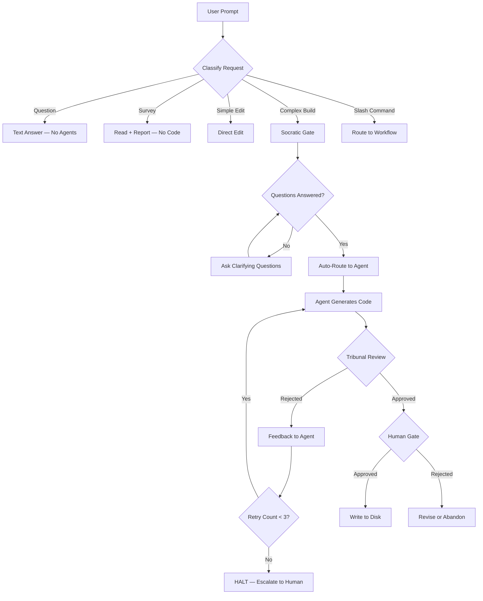

# 🏛️ Tribunal Anti-Hallucination Kit — Architecture

> Works natively in **Cursor**, **Windsurf**, **Antigravity**, and any AI IDE that indexes `.agent/` folders.

---

## System Flow



---

## Slash Commands (Workflows)

Type any of these in your AI IDE chat:

| Command | Purpose | File |
|---|---|---|
| `/generate` | Full Tribunal: Maker → Parallel Review → Human Gate | `workflows/generate.md` |
| `/review` | Audit existing code (no generation) | `workflows/review.md` |
| `/tribunal-full` | ALL 8 agents at once — maximum coverage | `workflows/tribunal-full.md` |
| `/tribunal-backend` | Logic + Security + Deps + Types | `workflows/tribunal-backend.md` |
| `/tribunal-frontend` | Logic + Security + Frontend + Types | `workflows/tribunal-frontend.md` |
| `/tribunal-database` | Logic + Security + SQL | `workflows/tribunal-database.md` |
| `/brainstorm` | Exploration mode — no code, just options | `workflows/brainstorm.md` |
| `/create` | Structured app creation (4-stage) | `workflows/create.md` |
| `/enhance` | Add/update features in existing apps | `workflows/enhance.md` |
| `/debug` | Systematic debugging with root cause analysis | `workflows/debug.md` |
| `/plan` | Project planning only — no code | `workflows/plan.md` |
| `/deploy` | Pre-flight checks + deployment | `workflows/deploy.md` |
| `/test` | Test generation and execution | `workflows/test.md` |
| `/preview` | Start/stop local dev server | `workflows/preview.md` |
| `/status` | Agent and project status board | `workflows/status.md` |
| `/orchestrate` | Multi-agent coordination | `workflows/orchestrate.md` |
| `/ui-ux-pro-max` | Plan and implement UI | `workflows/ui-ux-pro-max.md` |
| `/refactor` | Dependency-safe code refactoring | `workflows/refactor.md` |
| `/migrate` | Framework upgrades, DB migrations | `workflows/migrate.md` |
| `/audit` | Full project health audit | `workflows/audit.md` |
| `/fix` | Auto-fix lint, formatting, imports | `workflows/fix.md` |
| `/changelog` | Generate changelog from git history | `workflows/changelog.md` |

---

## The 8 Tribunal Agents

| Agent | File | Activates When |
|---|---|---|
| `logic-reviewer` | `agents/logic-reviewer.md` | All sessions (always on) |
| `security-auditor` | `agents/security-auditor.md` | All sessions (always on) |
| `performance-reviewer` | `agents/performance-reviewer.md` | "optimize", "slow", `/tribunal-full` |
| `dependency-reviewer` | `agents/dependency-reviewer.md` | "api", "backend", `/tribunal-full` |
| `type-safety-reviewer` | `agents/type-safety-reviewer.md` | "typescript", "api", `/tribunal-full` |
| `sql-reviewer` | `agents/sql-reviewer.md` | "query", "database", `/tribunal-full` |
| `frontend-reviewer` | `agents/frontend-reviewer.md` | "react", "hook", "component", `/tribunal-full` |
| `test-coverage-reviewer` | `agents/test-coverage-reviewer.md` | "test", "spec", "coverage", `/tribunal-full` |

---

## Specialist Agents

| Agent | Domain |
|---|---|
| `orchestrator` | Multi-agent coordination |
| `project-planner` | 4-phase structured planning |
| `backend-specialist` | API, server, auth |
| `frontend-specialist` | React, Next.js, UI |
| `database-architect` | Schema, queries, migrations |
| `mobile-developer` | React Native, Flutter |
| `devops-engineer` | CI/CD, Docker, deployment |
| `debugger` | Systematic debugging |
| `game-developer` | Game development |
| `security-auditor` | Penetration testing, OWASP |
| `penetration-tester` | Red team tactics |
| `performance-optimizer` | Profiling, optimization |
| `code-archaeologist` | Legacy code analysis |
| `explorer-agent` | Unknown codebase mapping |
| `documentation-writer` | Docs, READMEs, API docs |
| `test-engineer` | Test design and strategy |
| `qa-automation-engineer` | Test automation |
| `seo-specialist` | SEO auditing |
| `product-manager` | Feature prioritization |
| `product-owner` | Requirements, scope |

---

## How the Tribunal Works

```
User prompt
    │
    ▼
GEMINI.md → Classify request → Select active reviewers
    │
    ▼
MAKER generates code (context-bound, no hallucinations)
    │
    ▼
ALL SELECTED REVIEWERS run in parallel
    │
    ├── Logic      → hallucinated methods?
    ├── Security   → OWASP violations?
    ├── Deps       → fake npm packages?
    ├── Types      → any/unsafe casts?
    ├── SQL        → injection / N+1?
    ├── Frontend   → hooks violations?
    ├── Perf       → O(n²) / blocking I/O?
    └── Tests      → tautology / no edges?
    │
    ▼
VERDICT: All approved → HUMAN GATE (you approve or reject the diff)
         Any failed   → Feedback returned to Maker for revision (max 3 attempts)
         3 failures   → HALT and escalate to human
```

---

## Auto Domain Routing (GEMINI.md)

| Keywords in prompt | Extra reviewers added |
|---|---|
| api, route, endpoint, server | + Dependency + TypeSafety |
| sql, query, database, orm | + SQL |
| component, hook, react, next | + Frontend + TypeSafety |
| test, spec, coverage, jest | + TestCoverage |
| optimize, slow, memory, cpu | + Performance |

---

## Script Inventory

All scripts live in `.agent/scripts/`:

| Script | Purpose | Usage |
|---|---|---|
| `checklist.py` | Priority-ordered project audit | `python .agent/scripts/checklist.py .` |
| `verify_all.py` | Full pre-deploy validation | `python .agent/scripts/verify_all.py` |
| `auto_preview.py` | Local dev server management | `python .agent/scripts/auto_preview.py start` |
| `session_manager.py` | Multi-session state tracking | `python .agent/scripts/session_manager.py save "note"` |
| `lint_runner.py` | Standalone lint runner | `python .agent/scripts/lint_runner.py . --fix` |
| `test_runner.py` | Auto-detecting test runner | `python .agent/scripts/test_runner.py . --coverage` |
| `security_scan.py` | OWASP-aware source code scanner | `python .agent/scripts/security_scan.py .` |
| `dependency_analyzer.py` | Unused/phantom dep checker | `python .agent/scripts/dependency_analyzer.py . --audit` |
| `schema_validator.py` | DB schema validator | `python .agent/scripts/schema_validator.py .` |
| `bundle_analyzer.py` | JS/TS bundle size analyzer | `python .agent/scripts/bundle_analyzer.py . --build` |

---

## Error Recovery

```
Attempt 1  → Run with original parameters
Attempt 2  → Run with feedback from failure
Attempt 3  → Run with maximum constraints
Attempt 4  → HALT — escalate to human with full failure history
```

Script failures follow cascade rules:
- Security failure → **HALT** all steps
- Lint failure → continue, flag as deploy-blocker
- Test failure → continue analysis, mark incomplete
- Non-critical failure → log and continue

---

## Directory Structure

```
.agent/
├── ARCHITECTURE.md          ← This file
├── GEMINI.md                ← Root behavior config
├── agents/                  ← 27 specialist + reviewer agents
├── rules/GEMINI.md          ← Master rules (P0 priority)
├── scripts/                 ← 10 Python automation scripts
├── skills/                  ← 37 modular skill packages
└── workflows/               ← 22 slash command definitions
```
