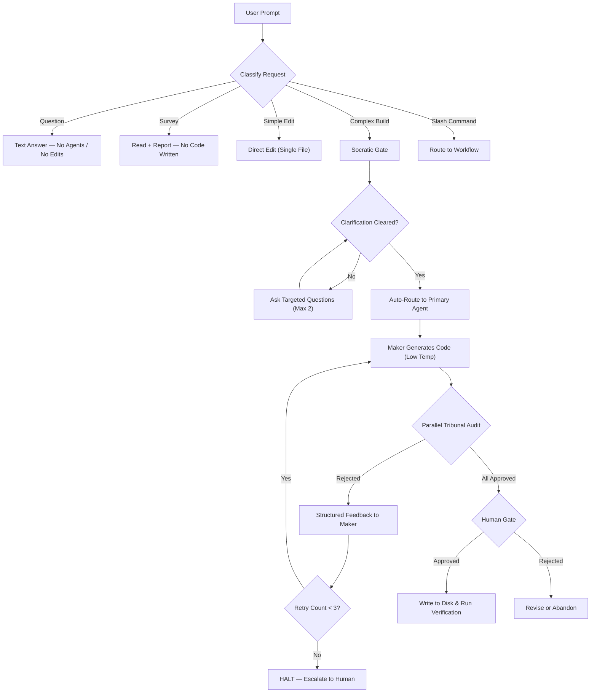

# 🏛️ Tribunal Anti-Hallucination Kit v6.0.1 — Architecture

Works natively in **Antigravity**, **Cursor**, **Windsurf**, and any AI IDE that indexes `.agent/` folders.

---

## 1. System Flow & Execution Lifecycle

```mermaid
flowchart TD
    A["User Prompt"] --> B{"Classify Request"}
    B -->|Question| C["Text Answer — No Agents / No Edits"]
    B -->|Survey| D["Read + Report — No Code Written"]
    B -->|Simple Edit| E["Direct Edit (Single File)"]
    B -->|Complex Build| F["Socratic Gate"]
    B -->|Slash Command| G["Route to Workflow"]

    F --> H{"Clarification Cleared?"}
    H -->|No| I["Ask Targeted Questions (Max 2)"]
    I --> H
    H -->|Yes| J["Auto-Route to Primary Agent"]

    J --> K["Maker Generates Code (Low Temp)"]
    K --> L{"Parallel Tribunal Audit"}
    L -->|All Approved| M{"Human Gate"}
    L -->|Rejected| N["Structured Feedback to Maker"]
    N --> O{"Retry Count < 3?"}
    O -->|Yes| K
    O -->|No| P["HALT — Escalate to Human"]

    M -->|Approved| Q["Write to Disk & Run Verification"]
    M -->|Rejected| R["Revise or Abandon"]
```

---

## 2. Option A + Option C Hybrid Architecture (v3.0.0 Standard)

### Subsystem A: 2-Tier Lazy Skill Routing Engine
- **Lightweight Index (`skill_topic_map.json`):** 183 skills indexed across 9 domain routes and file extensions (~500 tokens).
- **Startup Overhead:** ~2,500 – 3,500 startup tokens vs 85,000 tokens previously (95% token reduction).
- **Zero Exclusions:** All 183 skills remain indexed on disk; target skills are fetched dynamically on-demand via `view_file`.

### Subsystem C: Stage-Partitioned Tribunal Pipeline
- **3 Execution Waves:** Replaces monolithic 27-reviewer fan-out with 3 partitioned passes:
  - **Wave 1 (Core Integrity):** `precedence-reviewer`, `logic-reviewer`, `schema-reviewer`, `resilience-reviewer`
  - **Wave 2 (Security & Types):** `security-auditor`, `dependency-reviewer`, `type-safety-reviewer`, `complexity-reviewer`, `sql-reviewer`
  - **Wave 3 (Domain & Performance):** `frontend-reviewer`, `performance-reviewer`, `mobile-reviewer`, `ai-code-reviewer`, `test-coverage-reviewer`, `accessibility-reviewer`, `ui-ux-auditor`, `review-animations`, `vitals-reviewer`, `db-latency-auditor`, `throughput-optimizer`
- **Attention Preservation:** Reviewers execute in scoped 4-8 reviewer evaluation pairs, eliminating hallucination risks and attention dilution.

---

## 3. Skill-Script Binding Standard

Every skill in `.agent/skills/` conforms to the Option A+C Hybrid v3.0.0 frontmatter standard:
- `version`: `3.0.0`
- `script`: Primary executable script path in `.agent/scripts/`
- `scripts-binding`: Array of executable CLI tools (`security_scan.js`, `test_runner.js`, `schema_validator.js`, etc.)
- `skills`: Array of co-required brother skills for automatic 2-tier lazy resolution
