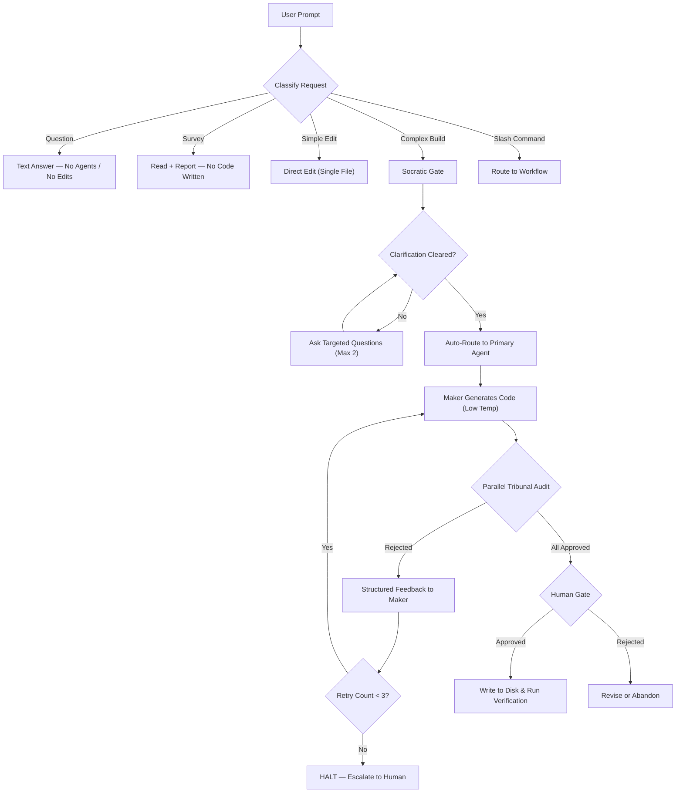
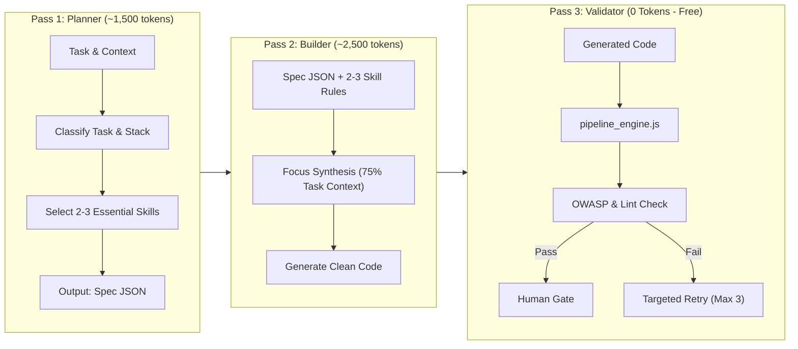
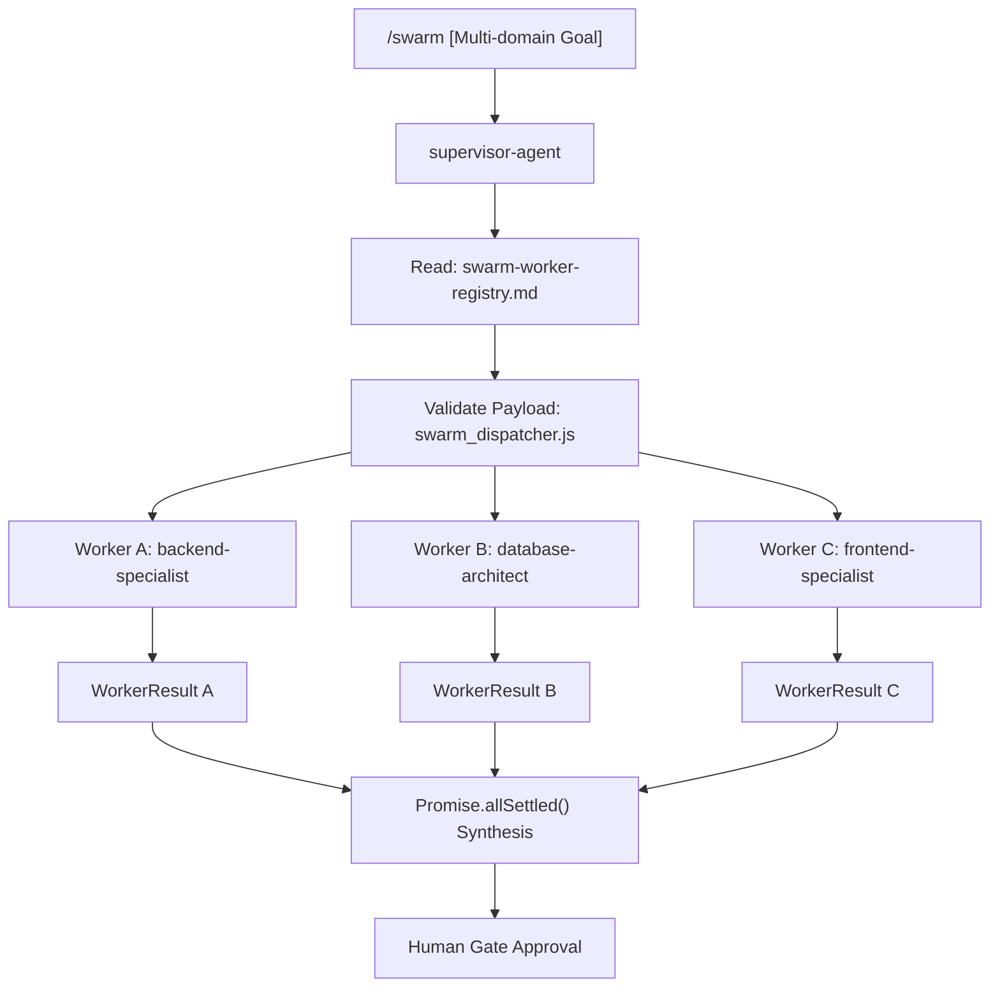
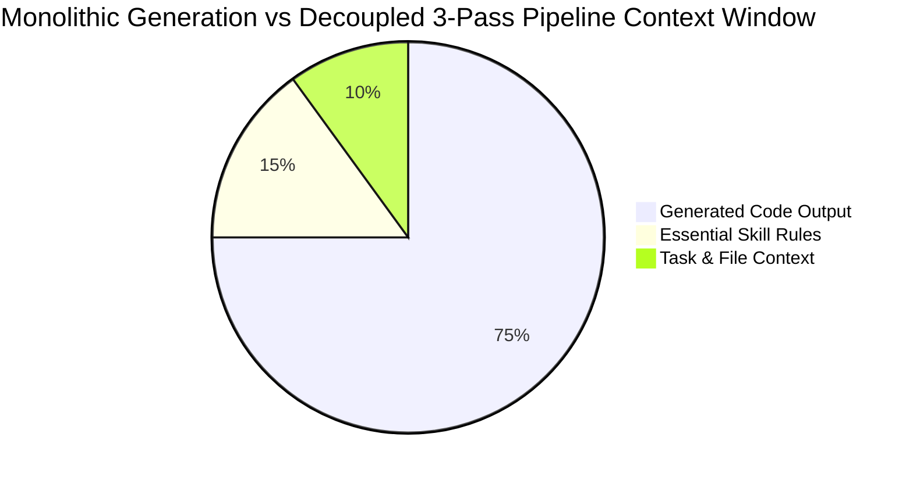

# 🏛️ Tribunal Anti-Hallucination Kit v3.0.0 — Architecture

Works natively in **Antigravity**, **Cursor**, **Windsurf**, and any AI IDE that indexes `.agent/` folders.

---

## 1. System Flow & Execution Lifecycle


```mermaid
flowchart TD
    A["User Prompt"] --> B{"Classify Request"}
    B -->|Question| C["Text Answer — No Agents / No Edits"]
    B -->|Survey| D["Read + Report — No Code Written"]
    B -->|Simple Edit| E["Direct Edit (Single File)"]
    B -->|Complex Build| F["Socratic Gate"]
    B -->|Slash Command| G["Route to Workflow"]

    F --> H{"Clarification Cleared?"}
    H -->|No| I["Ask Targeted Questions (Max 2)"]
    I --> H
    H -->|Yes| J["Auto-Route to Primary Agent"]

    J --> K["Maker Generates Code (Low Temp)"]
    K --> L{"Parallel Tribunal Audit"}
    L -->|All Approved| M{"Human Gate"}
    L -->|Rejected| N["Structured Feedback to Maker"]
    N --> O{"Retry Count < 3?"}
    O -->|Yes| K
    O -->|No| P["HALT — Escalate to Human"]

    M -->|Approved| Q["Write to Disk & Run Verification"]
    M -->|Rejected| R["Revise or Abandon"]
```

---

## 2. 3-Pass Hybrid Pipeline Architecture

The `/pipeline` engine uses a 3-pass decoupled architecture to separate planning, generation, and validation, saving ~89% of context window tokens compared to monolithic generation.


```mermaid
flowchart LR
    subgraph Pass1 ["Pass 1: Planner (~1,500 tokens)"]
        P1["Task & Context"] --> P2["Classify Task & Stack"]
        P2 --> P3["Select 2-3 Essential Skills"]
        P3 --> P4["Output: Spec JSON"]
    end

    subgraph Pass2 ["Pass 2: Builder (~2,500 tokens)"]
        B1["Spec JSON + 2-3 Skill Rules"] --> B2["Focus Synthesis (75% Task Context)"]
        B2 --> B3["Generate Clean Code"]
    end

    subgraph Pass3 ["Pass 3: Validator (0 Tokens - Free)"]
        V1["Generated Code"] --> V2["pipeline_engine.js"]
        V2 --> V3["OWASP & Lint Check"]
        V3 -->|Pass| V4["Human Gate"]
        V3 -->|Fail| V5["Targeted Retry (Max 3)"]
    end

    Pass1 --> Pass2 --> Pass3
```

---

## 3. Swarm / Supervisor Architecture

The `/swarm` workflow decomposes complex multi-domain goals into atomic, non-overlapping sub-tasks handled concurrently by specialist Workers.


```mermaid
flowchart TD
    A["/swarm [Multi-domain Goal]"] --> B["supervisor-agent"]
    B --> C["Read: swarm-worker-registry.md"]
    C --> D["Validate Payload: swarm_dispatcher.js"]

    D --> E1["Worker A: backend-specialist"]
    D --> E2["Worker B: database-architect"]
    D --> E3["Worker C: frontend-specialist"]

    E1 --> F1["WorkerResult A"]
    E2 --> F2["WorkerResult B"]
    E3 --> F3["WorkerResult C"]

    F1 & F2 & F3 --> G["Promise.allSettled() Synthesis"]
    G --> H["Human Gate Approval"]
```

---

## 4. Context Window Token Budget Breakdown


```mermaid
pie title Monolithic Generation vs Decoupled 3-Pass Pipeline Context Window
    "Generated Code Output" : 75
    "Essential Skill Rules" : 15
    "Task & File Context" : 10
```

* **Monolithic `/generate`**: Uses ~12,000–18,000 tokens per pass (89% spent on system rules & personas).
* **Decoupled `/pipeline`**: Uses ~2,500 tokens in Pass 2 (75%+ of context window dedicated exclusively to code synthesis).

---

## 5. The 21 Parallel Tribunal Reviewers

When code is generated or audited, domain reviewers evaluate the diff in parallel. Approval requires unanimous pass across all assigned reviewers.

| Reviewer Agent | Agent File | Primary Domain & Activation Signals |
| :--- | :--- | :--- |
| `logic-reviewer` | `agents/logic-reviewer.md` | **Always Active** — Core logic, boundary conditions, edge cases |
| `security-auditor` | `agents/security-auditor.md` | **Always Active** — OWASP Top 10, sanitization, secret exposure |
| `precedence-reviewer` | `agents/precedence-reviewer.md` | **Always Active** — Checks Case Law & project architectural precedents |
| `complexity-reviewer` | `agents/complexity-reviewer.md` | **Always Active** — Over-engineering, Dependency Ladder enforcement |
| `type-safety-reviewer` | `agents/type-safety-reviewer.md` | TypeScript strictness, zero `as any` policy, generic constraints |
| `dependency-reviewer` | `agents/dependency-reviewer.md` | Phantom package detection, `package.json` verification |
| `resilience-reviewer` | `agents/resilience-reviewer.md` | Fault tolerance, retries, circuit breakers, error boundaries |
| `schema-reviewer` | `agents/schema-reviewer.md` | Input validation, Zod / Pydantic schemas, contract boundaries |
| `frontend-reviewer` | `agents/frontend-reviewer.md` | React 19 / Next.js Server Components, hook rules, state mutations |
| `ui-ux-auditor` | `agents/ui-ux-auditor.md` | Usability heuristics, responsive layouts, spatial systems |
| `visual-reviewer` | `agents/visual-reviewer.md` | Visual hierarchy, typography scaling, OKLCH color palettes |
| `interaction-reviewer` | `agents/interaction-reviewer.md` | Micro-interactions, hover/focus/active states, tactile feedback |
| `anti-pattern-reviewer` | `agents/anti-pattern-reviewer.md` | Banned AI clichés (purple gradients, generic hero grids) |
| `accessibility-reviewer` | `agents/accessibility-reviewer.md` | WCAG 2.2 AA compliance, ARIA attributes, keyboard navigation |
| `sql-reviewer` | `agents/sql-reviewer.md` | Parameterized queries, ORM safety, transaction integrity |
| `db-latency-auditor` | `agents/db-latency-auditor.md` | Slow query detection, index optimization, N+1 query prevention |
| `mobile-reviewer` | `agents/mobile-reviewer.md` | React Native, Expo Router, 60fps Reanimated worklets, safe areas |
| `performance-reviewer` | `agents/performance-reviewer.md` | O(n²) bottlenecks, layout thrashing, memory leaks |
| `vitals-reviewer` | `agents/vitals-reviewer.md` | Core Web Vitals (LCP, CLS, INP, TTFB) depth analysis |
| `throughput-optimizer` | `agents/throughput-optimizer.md` | Event-loop blocking, server concurrency, streaming optimization |
| `ai-code-reviewer` | `agents/ai-code-reviewer.md` | LLM SDK parameters, prompt injection defense, token explosion |

---

## 6. 29 Specialist Domain Agents

| Domain Specialist | Agent File | Focus Area & Capabilities |
| :--- | :--- | :--- |
| `supervisor-agent` | `agents/supervisor-agent.md` | Swarm triage, Worker dispatch, result synthesis |
| `orchestrator` | `agents/orchestrator.md` | Multi-agent workflow coordination & fan-out |
| `agent-organizer` | `agents/agent-organizer.md` | Agent ecosystem management & memory distillation |
| `project-planner` | `agents/project-planner.md` | 4-phase structured implementation planning |
| `backend-specialist` | `agents/backend-specialist.md` | Node.js, Express, Hono, API design, Server Actions |
| `frontend-specialist` | `agents/frontend-specialist.md` | Modern Web UI, CSS systems, component architecture |
| `react-specialist` | `agents/react-specialist.md` | React 19, Server Components, Zustand, TanStack Query |
| `nextjs-react-expert` | `agents/nextjs-react-expert.md` | Next.js 15 App Router, PPR, Server Actions, Middleware |
| `vue-expert` | `agents/vue-expert.md` | Vue 3.5+, Composition API, Nuxt 4, Pinia |
| `python-pro` | `agents/python-pro.md` | Python 3.12+, FastAPI, Pydantic v2, Asyncio, Pytest |
| `rust-pro` | `agents/rust-pro.md` | Rust 1.75+, Tokio async, Axum, Serde, memory safety |
| `csharp-developer` | `agents/csharp-developer.md` | C# 12, .NET 8/9, ASP.NET Core, Blazor architecture |
| `database-architect` | `agents/database-architect.md` | Data modeling, Prisma/Drizzle schema design, migrations |
| `sql-pro` | `agents/sql-pro.md` | PostgreSQL, Supabase RLS, complex analytical SQL |
| `mobile-developer` | `agents/mobile-developer.md` | Expo, React Native, Flutter, native modules |
| `devops-engineer` | `agents/devops-engineer.md` | Docker, CI/CD pipelines, GitHub Actions, deployment |
| `platform-engineer` | `agents/platform-engineer.md` | Cloud-native infrastructure, Kubernetes, Terraform |
| `cloud-engineer` | `agents/cloud-engineer.md` | AWS, Serverless, IaC, edge computing topology |
| `devops-incident-responder` | `agents/devops-incident-responder.md` | Incident root cause investigation & hotfixes |
| `debugger` | `agents/debugger.md` | 4-phase systematic debugging & traceback isolation |
| `system-architect` | `agents/system-architect.md` | Capacity planning, scale estimation, distributed systems |
| `code-archaeologist` | `agents/code-archaeologist.md` | Legacy codebase analysis, debt mapping, seams |
| `explorer-agent` | `agents/explorer-agent.md` | Unknown codebase mapping & dependency graph discovery |
| `documentation-writer` | `agents/documentation-writer.md` | Technical documentation, OpenAPI, README generation |
| `test-engineer` | `agents/test-engineer.md` | Testing Trophy strategy, behavioral test design |
| `qa-automation-engineer` | `agents/qa-automation-engineer.md` | E2E Playwright testing, CI test automation |
| `seo-specialist` | `agents/seo-specialist.md` | Technical SEO, OpenGraph, Core Web Vitals optimization |
| `product-manager` | `agents/product-manager.md` | Feature prioritization, scope control, user stories |
| `product-owner` | `agents/product-owner.md` | Backlog management, acceptance criteria verification |

---

## 7. 36 Slash Commands & Workflows

Type any of these commands in your AI IDE chat to trigger specialized workflows:

| Command | Purpose | File Path |
| :--- | :--- | :--- |
| `/generate` | Full Tribunal: Maker → Parallel Review → Human Gate | [`workflows/generate.md`](workflows/generate.md) |
| `/review` | Pure read-only hallucination audit | [`workflows/review.md`](workflows/review.md) |
| `/tribunal-full` | Comprehensive 21-reviewer parallel audit | [`workflows/tribunal-full.md`](workflows/tribunal-full.md) |
| `/tribunal-backend` | Logic + Security + Deps + Type Safety + Resilience + Schema | [`workflows/tribunal-backend.md`](workflows/tribunal-backend.md) |
| `/tribunal-frontend` | Logic + Security + Frontend + Types + UI/UX + Motion + Visual | [`workflows/tribunal-frontend.md`](workflows/tribunal-frontend.md) |
| `/tribunal-database` | Logic + Security + SQL parameterization audit | [`workflows/tribunal-database.md`](workflows/tribunal-database.md) |
| `/tribunal-mobile` | Logic + Security + Mobile 60fps Reanimated audit | [`workflows/tribunal-mobile.md`](workflows/tribunal-mobile.md) |
| `/tribunal-performance` | Logic + Performance optimization audit | [`workflows/tribunal-performance.md`](workflows/tribunal-performance.md) |
| `/tribunal-ui` | Dedicated UI/UX design heuristics audit | [`workflows/tribunal-ui.md`](workflows/tribunal-ui.md) |
| `/tribunal-speed` | Full-stack parallel performance swarm (max 5 AI calls) | [`workflows/tribunal-speed.md`](workflows/tribunal-speed.md) |
| `/brainstorm` | Socratic exploration mode — 3 options & tradeoffs | [`workflows/brainstorm.md`](workflows/brainstorm.md) |
| `/create` | Full application creation from requirements to scaffold | [`workflows/create.md`](workflows/create.md) |
| `/enhance` | Dependency-safe feature addition & impact analysis | [`workflows/enhance.md`](workflows/enhance.md) |
| `/debug` | 4-phase systematic root cause investigation | [`workflows/debug.md`](workflows/debug.md) |
| `/plan` | Strategic 4-phase implementation planning | [`workflows/plan.md`](workflows/plan.md) |
| `/deploy` | Pre-flight safety checks & production release gates | [`workflows/deploy.md`](workflows/deploy.md) |
| `/test` | Behavioral test generation & execution | [`workflows/test.md`](workflows/test.md) |
| `/preview` | Local dev server lifecycle management | [`workflows/preview.md`](workflows/preview.md) |
| `/status` | Project health dashboard & active execution ledger | [`workflows/status.md`](workflows/status.md) |
| `/session` | Multi-session state tracking & restoration | [`workflows/session.md`](workflows/session.md) |
| `/orchestrate` | Multi-agent fan-out/fan-in coordination | [`workflows/orchestrate.md`](workflows/orchestrate.md) |
| `/swarm` | Multi-agent swarm supervisor & JSON contract dispatcher | [`workflows/swarm.md`](workflows/swarm.md) |
| `/strengthen-skills` | Skill hardening & Tribunal guardrail injector | [`workflows/strengthen-skills.md`](workflows/strengthen-skills.md) |
| `/ui-ux-pro-max` | Picasso design specification & 16-step UI engine | [`workflows/ui-ux-pro-max.md`](workflows/ui-ux-pro-max.md) |
| `/refactor` | Dependency-safe structural code refactoring | [`workflows/refactor.md`](workflows/refactor.md) |
| `/migrate` | Expand-and-contract database & framework migrations | [`workflows/migrate.md`](workflows/migrate.md) |
| `/audit` | Full project health assessment & priority script audit | [`workflows/audit.md`](workflows/audit.md) |
| `/fix` | Automated error resolution & lint diff preview | [`workflows/fix.md`](workflows/fix.md) |
| `/changelog` | Conventional commit history to changelog compiler | [`workflows/changelog.md`](workflows/changelog.md) |
| `/review-ai` | LLM integration & prompt injection defense audit | [`workflows/review-ai.md`](workflows/review-ai.md) |
| `/pipeline` | Token-efficient 3-pass code generation pipeline | [`workflows/pipeline.md`](workflows/pipeline.md) |
| `/super-prompt` | Zero-token local prompt compiler | [`workflows/super-prompt.md`](workflows/super-prompt.md) |
| `/marathon` | Multi-session long-running agent harness | [`workflows/marathon.md`](workflows/marathon.md) |
| `/acf` | Agent Context Format spec distillation | [`workflows/acf.md`](workflows/acf.md) |
| `/api-tester` | Multi-stage auth-aware API endpoint testing | [`workflows/api-tester.md`](workflows/api-tester.md) |
| `/performance-benchmarker` | Evidence-based Core Web Vitals measurement | [`workflows/performance-benchmarker.md`](workflows/performance-benchmarker.md) |

---

## 8. Complete 32-Script Automation Inventory

All scripts live in `.agent/scripts/`:

| Script Name | Primary Function | Command Example |
| :--- | :--- | :--- |
| `security_scan.js` | Deep OWASP-aware source code security scanner | `node .agent/scripts/security_scan.js .` |
| `dependency_analyzer.js` | Unused/phantom dependency audit & npm security audit | `node .agent/scripts/dependency_analyzer.js . --audit` |
| `lint_runner.js` | Standalone multi-linter runner (ESLint, Prettier, Ruff) | `node .agent/scripts/lint_runner.js . --fix` |
| `schema_validator.js` | DB schema validator (Prisma, Drizzle, SQL) | `node .agent/scripts/schema_validator.js .` |
| `test_runner.js` | Auto-detecting test runner (Jest, Vitest, Pytest) | `node .agent/scripts/test_runner.js . --coverage` |
| `bundle_analyzer.js` | JS/TS production bundle size analyzer | `node .agent/scripts/bundle_analyzer.js . --build` |
| `verify_all.js` | Comprehensive pre-deploy validation suite | `node .agent/scripts/verify_all.js` |
| `checklist.js` | Priority audit: Security → Dependencies → Types → Lint | `node .agent/scripts/checklist.js .` |
| `auto_preview.js` | Local development server lifecycle manager | `node .agent/scripts/auto_preview.js start` |
| `session_manager.js` | Multi-session state tracking & snapshot restoration | `node .agent/scripts/session_manager.js status` |
| `swarm_dispatcher.js` | Validates Swarm WorkerRequest/WorkerResult payloads | `node .agent/scripts/swarm_dispatcher.js --file payload.json` |
| `skill_integrator.js` | Maps active skills to executable scripts | `node .agent/scripts/skill_integrator.js` |
| `pipeline_engine.js` | 3-pass hybrid pipeline orchestrator (Plan/Build/Validate) | `node .agent/scripts/pipeline_engine.js --task "..." --dry-run` |
| `prompt_compiler.js` | Zero-token local prompt compiler to dense YAML | `node .agent/scripts/prompt_compiler.js "build login"` |
| `strengthen_skills.js` | Hardens skills with Pre-Flight & VBC guardrails | `node .agent/scripts/strengthen_skills.js . --dry-run` |
| `test_swarm_dispatcher.js` | Integration test suite for swarm dispatcher | `npx jest test/integration/swarm_dispatcher.test.js` |
| `auto_fixer.js` | Automated formatting & import cleanup engine | `node .agent/scripts/auto_fixer.js .` |
| `context_snapshot.js` | Compacts large codebase graphs for 27x context reduction | `node .agent/scripts/context_snapshot.js .` |
| `skill_evolution.js` | Extracts project idioms & auto-evolves project-idioms skill | `node .agent/scripts/skill_evolution.js .` |

*(Note: Additional internal helper scripts in `.agent/scripts/` handle AST parsing, diff formatting, and IPC message routing).*

---

## 9. Kit v3.0.0 Specification Standards

### Option B Agent Standard (50 Agents)
* **YAML Frontmatter**: Version `3.0.0`, `last-updated: 2026-07-29`, clean `skills` array, tool declarations, model targets.
* **Mandatory Pre-Flight Context Inspection**: Grounded list of workspace files inspected prior to action.
* **Framework Decision Trees & Blueprints**: Version-pinned decision matrices (React 19, Next 15, Prisma 6, Node 20+, Python 3.12+, Expo Router v4).
* **Hand-Off & Coordination Protocols**: Explicit `@agent` routing contracts.

### Option A+C Hybrid Skill Standard (175 Skills)
* **YAML Frontmatter**: Version `3.0.0`, `last-updated: 2026-07-30`, array-style `skills` co-requirements, `tools` declaration, `scripts-binding` array pointing to `.agent/scripts/`.
* **Mandatory Pre-Flight Context Inspection**: Specific numbered section targets and rules that agents MUST check before executing the skill.
* **Tribunal Integration & VBC Protocol**: Anti-hallucination guardrails and Verification-Before-Completion evidence validation.

### Workflow Standard v3.0.0 (36 Workflows)
* **YAML Frontmatter**: Version `3.0.0`, `last-updated: 2026-07-30`, array-style `required-skills`, `tools` declaration, `scripts-binding` array.
* **Mandatory Pre-Flight Context Inspection**: Workspace inspection checks and execution HALT conditions prior to tool invocation.

---

## 10. Directory Structure & File Map

```
.agent/
├── ARCHITECTURE.md          ← This file (Kit v3.0.0 Master Architecture)
├── GEMINI.md                ← Master operational rules & auto domain router
├── agents/                  ← 50 Option B v3.0.0 Agents (21 Parallel Reviewers + 29 Domain Specialists)
│   ├── supervisor-agent.md  ← Swarm triage, dispatch, synthesis
│   ├── swarm-worker-contracts.md  ← WorkerRequest/WorkerResult schemas
│   └── swarm-worker-registry.md   ← Task type → agent routing map
├── rules/
│   ├── GEMINI.md            ← Master rules (P0 priority)
│   └── GEMINI_PLANNER.md   ← Condensed planner rules for /pipeline Pass 1
├── scripts/                 ← 32 automation scripts
│   └── pipeline_engine.js   ← 3-pass hybrid pipeline engine
├── skills/                  ← 175 Option A+C Hybrid v3.0.0 Skills
├── patterns/                ← 5 ADK skill base patterns
├── history/                 ← Case Law + Skill Evolution data
└── workflows/               ← 36 Workflow Standard v3.0.0 Slash Commands
    ├── swarm.md             ← /swarm orchestration procedure
    └── pipeline.md          ← /pipeline hybrid generation procedure
```
