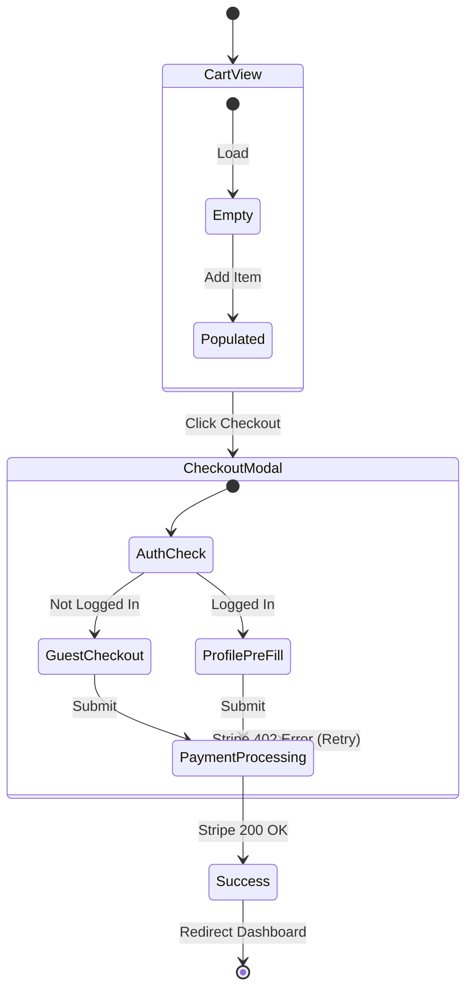

# Appflow & Wireframing — Visualization Mastery

---

## 1. The Mermaid Appflow Protocol

When asked to "design the flow", do not write prose. Write deterministic Mermaid diagrams that map state interactions.

### Example: E-Commerce Checkout Flow



---

## 2. Low-Fidelity Wireframe Notation

When asked to define the UI layout conceptually before building Shadcn/Tailwind components, use structural ASCII/Markdown notation to establish layout boundaries.

```text
[ HEADER: Logo (Left) | Search Bar (Center, expanding) | User Avatar (Right) ]
-------------------------------------------------------------------------
[ SIDEBAR (Sticky, W-64) ] |  [ HERO SECTION: H1 Hook | CTA Button Primary ]
- Dashboard                |  [ .......................................... ]
- Analytics                |  [ FEATURE GRID (CSS Grid columns-3)        ]
- Settings                 |  [ [Card 1]     [Card 2]      [Card 3]      ]
[........................] |  [..........................................]
```

**Why do this?**
Because moving an ASCII box takes 3 seconds. Rewriting 4 nested div flexbox tails takes 5 minutes. Secure the approval on the wireframe before touching code.

---

## 3. The Empty State / Loading State Mandate

When mapping application flows, AI frequently charts the "Happy Path" (User logs in -> User sees 10 items). 

Every single screen designed in an App Flow MUST explicitly define:
1. **The Loading State:** What does the user see while the network executes? (Skeleton loaders vs Spinners).
2. **The Empty State:** What does the UI look like on Day 1 when the user has zero data? (An empty white screen is an instant bounce-rate death sentence; use an Empty State CTA).

---

## 4. Interaction Matrices (Event Mapping)

Before writing React, chart exactly what the user can do on the screen and what the system does in response.

|Interaction|Trigger|System Response Hook|Edge Case|
|:---|:---|:---|:---|
|Click `Add to Cart`|`onClick`|Dispatch `Zustand.add(item)`|If out of stock, render Toast|
|Scroll to Bottom|`IntersectionObserver`|`fetchNextPage()`|Reached max items, show footer|
|Click outside Modal|`useClickAway`|`setIsOpen(false)`|Prevent close if form is dirty|

---
