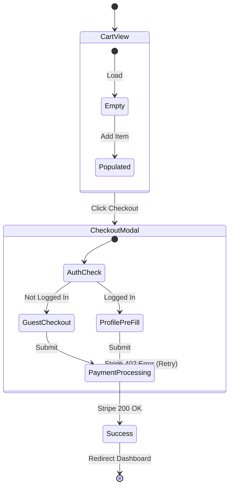

# Appflow & Wireframing — Visualization Mastery

> You cannot code a cohesive application if you don't know what screens exist.
> Stop writing components until the user journey graph is mathematically complete.

---

## 1. The Mermaid Appflow Protocol

When asked to "design the flow", do not write prose. Write deterministic Mermaid diagrams that map state interactions.

### Example: E-Commerce Checkout Flow



---

## 2. Low-Fidelity Wireframe Notation

When asked to define the UI layout conceptually before building Shadcn/Tailwind components, use structural ASCII/Markdown notation to establish layout boundaries.

```text
[ HEADER: Logo (Left) | Search Bar (Center, expanding) | User Avatar (Right) ]
-------------------------------------------------------------------------
[ SIDEBAR (Sticky, W-64) ] |  [ HERO SECTION: H1 Hook | CTA Button Primary ]
- Dashboard                |  [ .......................................... ]
- Analytics                |  [ FEATURE GRID (CSS Grid columns-3)        ]
- Settings                 |  [ [Card 1]     [Card 2]      [Card 3]      ]
[........................] |  [..........................................]
```

**Why do this?**
Because moving an ASCII box takes 3 seconds. Rewriting 4 nested div flexbox tails takes 5 minutes. Secure the approval on the wireframe before touching code.

---

## 3. The Empty State / Loading State Mandate

When mapping application flows, AI frequently charts the "Happy Path" (User logs in -> User sees 10 items). 

Every single screen designed in an App Flow MUST explicitly define:
1. **The Loading State:** What does the user see while the network executes? (Skeleton loaders vs Spinners).
2. **The Empty State:** What does the UI look like on Day 1 when the user has zero data? (An empty white screen is an instant bounce-rate death sentence; use an Empty State CTA).

---

## 4. Interaction Matrices (Event Mapping)

Before writing React, chart exactly what the user can do on the screen and what the system does in response.

| Interaction | Trigger | System Response Hook | Edge Case |
|:---|:---|:---|:---|
| Click `Add to Cart` | `onClick` | Dispatch `Zustand.add(item)` | If out of stock, render Toast |
| Scroll to Bottom | `IntersectionObserver` | `fetchNextPage()` | Reached max items, show footer |
| Click outside Modal | `useClickAway` | `setIsOpen(false)` | Prevent close if form is dirty |

---

## 🤖 LLM-Specific Traps (Appflow Wireframing)

1. **Jumping straight to code:** A user asks for app ideas, and the AI replies with `npx create-next-app` instead of laying out the fundamental visual logic diagram.
2. **Mermaid Syntax Hallucinations:** Writing invalid Mermaid.js schemas (using broken bracket geometries `[->]` instead of `-->`). Always stick to standard `graph TD`, `flowchart`, or `stateDiagram-v2`.
3. **The Unbroken Happy Path:** Writing user flows that completely ignore form validation errors, network 500 crashes, or rejected authentication logic.
4. **Desktop Exclusivity:** Creating structural wireframes assuming a 1920x1080 horizontal layout, completely failing to define how the Desktop Sidebar flows into a Mobile Hamburger menu.
5. **Missing the "Back" Button:** Charting user journeys that drive players deep into settings menus with absolutely no topological path charted back to the dashboard state.
6. **Abstract Ambiguity:** Plotting a state box named `ProcessData` instead of defining the UI interaction block `PaymentProcessingSpinner`. Keep flows strictly anchored to what the User physically perceives on screen.
7. **Prose Overloading:** Explaining an application flow with 4 paragraphs of dense text. Visual modeling (Markdown matrices, ASCII grids, Mermaid) is universally superior for architectural consensus.
8. **Stateless UI Mapping:** Charting wireframes that ignore interactive states (Hover, Active, Focused, Disabled).
9. **Monolithic Modals:** Planning complex 4-step wizard forms inside a single generic "Modal" state, hiding the fact that internal routing and state-persistence logic is required.
10. **Refusal to Request Sign-off:** Generating a wireframe structure and then immediately generating the 5 React files underneath it before the user actually approved the structural layout.

---

## 🏛️ Tribunal Integration

### ✅ Pre-Flight Self-Audit
```
✅ Are complex multi-screen flows mathematically defined using valid Mermaid.js diagrams?
✅ Do the state diagrams explicitly account for Loading, Empty, and Error state routing?
✅ Has the "Happy Path" been broken by deliberately charting network/validation failure loops?
✅ Are Low-Fi ASCII/Markdown wireframes structurally sound and easy for the user to interpret?
✅ Were Interaction Matrices used to cleanly map User Triggers to System Hooks?
✅ Does the architectural design handle responsive degradation (e.g., Desktop Sidebar -> Mobile drawer)?
✅ Have user escape hatches (e.g., 'Back' buttons, clicking outside modals) been mapped?
✅ Did I strictly halt execution to wait to secure user approval on the wireframe before writing code?
✅ Has visual fluff been stripped to focus strictly on constraints, hierarchy, and system flow?
✅ Did I prevent hiding complex multi-step state machines inside a single vague "Settings" box?
```
