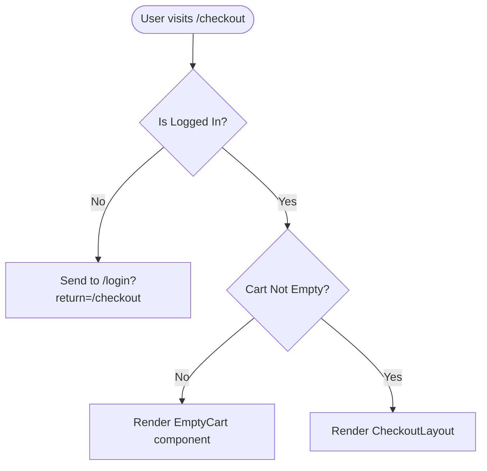

# Appflow & Wireframing Skill

This skill empowers the planner agent to outline precise user journeys and screen layouts directly in `PLAN-{slug}.md` files. The output must be perfectly readable by humans and easily parsed by downstream code generation agents (like `frontend-specialist`).

## Phase 1: App Flow Mapping (Mermaid.js)

Before creating wireframes, you must map the logical user journey using a Mermaid.js flowchart. 

### Rules for Flows:
- Use `mermaid` blocks with `flowchart TD` (Top-to-Down) or `LR` (Left-to-Right).
- Focus strictly on state transitions, conditional logic, auth barriers, and API boundaries.
- Label all decision edges clearly.

**Example:**


## Phase 2: Semantic Wireframing (Pseudo-XML) & UI Accuracy

For mapping UI elements, NEVER use vague bullet points or basic ASCII art. You must use the **Tribunal Structural XML** format. This enforces a component-thinking mindset and provides 1:1 structural intent for the frontend agent.

### Rules for UI Accuracy & Tokens:
To ensure the frontend agent translates the wireframe with pixel-perfect accuracy, you must use explicit spacing, typography, and layout generic tokens (based on a 4px grid) rather than vague words like "large" or "small".

- Use PascalCase for components (`<Sidebar>`, `<DataGrid>`, `<MetricCard>`).
- Define exact layout constraints: `layout="flex-col"`, `flex="1"`, `items="center"`, `justify="between"`.
- Define spacing using standard numeric scales (1 = 4px): `p="4"`, `gap="2"`, `m="8"`.
- Define typography explicit roles: `text="xs | sm | base | lg | xl | 2xl"`, `font="bold"`, `text-color="muted"`.
- Define explicit widths/heights: `w="full"`, `max-w="7xl"`, `h="100vh"`.
- Provide responsive breakpoints explicitly: `<Grid cols="1" md-cols="3">`.

**Example:**
```xml
<Screen name="Checkout" layout="flex-row" max-w="7xl" mx="auto" p="4" md-p="8">
  <MainColumn layout="flex-col" gap="8" flex="1">
    <Section title="Shipping Details" text="xl" font="semibold">
      <AddressForm fields="Name, Street, City, Zip" gap="4" />
    </Section>
    <Section title="Payment Method" text="xl" font="semibold">
      <PaymentElement provider="Stripe" p="4" border="1" radius="md" />
    </Section>
  </MainColumn>

  <SidebarColumn layout="sticky" w="full" md-w="96" p="6" bg="surface-variant" radius="lg">
    <OrderSummary layout="flex-col" gap="4">
      <CartList items="[CartContext]" />
      <Divider />
      <Subtotal layout="flex-row" justify="between" text="sm" text-color="muted" />
      <Tax calculation="dynamic" layout="flex-row" justify="between" text="sm" text-color="muted" />
      <Divider />
      <Total layout="flex-row" justify="between" text="lg" font="bold" />
      <Button action="submitCheckout" variant="primary" w="full" py="3" radius="md">Pay Now</Button>
    </OrderSummary>
  </SidebarColumn>
</Screen>
```

## Execution Checklist for the Planner:
- [ ] Has the logical flow been verified in the Mermaid graph?
- [ ] Does every screen mentioned in the flow have a corresponding `<Screen>` XML wireframe?
- [ ] Are the wireframe nodes purely structural (no hallucinated styles)?
