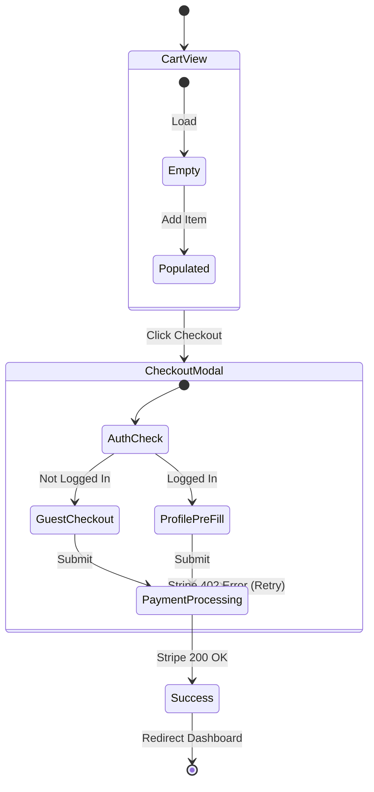

# Appflow & Wireframing — Visualization Mastery

## Mandatory Pre-Flight Context Inspection

Before generating, refactoring, or reviewing code in the `appflow-wireframe` domain, inspect these 5 critical parameters:

1. **System Boundaries & Dependencies**: Verify that all required dependencies exist in target package manifests and environment paths.
2. **Runtime Context & Platform Invariants**: Confirm target platform constraints (Node.js, Browser, Mobile OS, Edge runtime) before applying APIs.
3. **Execution Guardrails**: Identify potential side-effects, state mutations, and unhandled asynchronous exceptions.
4. **Validation & Type Contracts**: Validate input data schemas and strict type constraints across all module interfaces.
5. **Observability & Proof of Execution**: Ensure execution produces tangible verification signals (terminal output, tests, metrics).

## Activation Boundaries

- **Activate when:** Use when Application flow and wireframing mastery. Mermaid.js flowcharting, state diagrams, user journey mapping, interaction matrices, explicit screen boundary demarcation, and accessibility flow modeling. Use when planning UI architectures, designing user onboarding flows, or visualizing complex state machines before writing code.
- **DO NOT activate when:** The task falls outside the `appflow-wireframe` domain or is managed by a different dedicated specialist.

## 🔁 Multi-Pass Execution Protocol

Execute all non-trivial tasks through this 7-pass cognitive loop:

| Pass       | Phase            | Core Action                                                                                  |
| :--------- | :--------------- | :------------------------------------------------------------------------------------------- |
| **Pass 1** | **Understand**   | Deconstruct the user's explicit objective, implicit requirements, and platform constraints.  |
| **Pass 2** | **Plan**         | Decompose the task into smallest logical steps; map dependencies and required tool calls.    |
| **Pass 3** | **Execute**      | Implement the solution with production-grade craft, zero placeholders, and strict typing.    |
| **Pass 4** | **Verify**       | Run linters, unit tests, or compiler checks to validate structural correctness.              |
| **Pass 5** | **Attack**       | Perform an adversarial review searching for edge-case failures, race conditions, and traps.  |
| **Pass 6** | **Improve**      | Eliminate discovered friction, optimize performance, and harden error boundaries.            |
| **Pass 7** | **Quality Gate** | Enforce Verification-Before-Completion (VBC) with concrete terminal proof before finalizing. |

---

## 🛠️ Technical Architecture & Reference Recipes

## Hallucination Traps (Read First)

---

---

## 1. The Mermaid Appflow Protocol

When asked to "design the flow", do not write prose. Write deterministic Mermaid diagrams that map state interactions.

### Example: E-Commerce Checkout Flow


```mermaid
stateDiagram-v2
    [*] --> CartView

    state CartView {
        [*] --> Empty: Load
        Empty --> Populated: Add Item
    }

    CartView --> CheckoutModal: Click Checkout

    state CheckoutModal {
        [*] --> AuthCheck
        AuthCheck --> GuestCheckout: Not Logged In
        AuthCheck --> ProfilePreFill: Logged In

        GuestCheckout --> PaymentProcessing: Submit
        ProfilePreFill --> PaymentProcessing: Submit
    }

    PaymentProcessing --> Success: Stripe 200 OK
    PaymentProcessing --> CheckoutModal: Stripe 402 Error (Retry)

    Success --> [*]: Redirect Dashboard
```

---

## 2. Low-Fidelity Wireframe Notation

When asked to define the UI layout conceptually before building Shadcn/Tailwind components, use structural ASCII/Markdown notation to establish layout boundaries.

```text
[ HEADER: Logo (Left) | Search Bar (Center, expanding) | User Avatar (Right) ]
-------------------------------------------------------------------------
[ SIDEBAR (Sticky, W-64) ] |  [ HERO SECTION: H1 Hook | CTA Button Primary ]
- Dashboard                |  [ .......................................... ]
- Analytics                |  [ FEATURE GRID (CSS Grid columns-3)        ]
- Settings                 |  [ [Card 1]     [Card 2]      [Card 3]      ]
[........................] |  [..........................................]
```

**Why do this?**
Because moving an ASCII box takes 3 seconds. Rewriting 4 nested div flexbox tails takes 5 minutes. Secure the approval on the wireframe before touching code.

---

## 3. The Empty State / Loading State Mandate

When mapping application flows, AI frequently charts the "Happy Path" (User logs in -> User sees 10 items).

Every single screen designed in an App Flow MUST explicitly define:

1. **The Loading State:** What does the user see while the network executes? (Skeleton loaders vs Spinners).
2. **The Empty State:** What does the UI look like on Day 1 when the user has zero data? (An empty white screen is an instant bounce-rate death sentence; use an Empty State CTA).

---

## 4. Interaction Matrices (Event Mapping)

Before writing React, chart exactly what the user can do on the screen and what the system does in response.

| Interaction         | Trigger                | System Response Hook         | Edge Case                      |
| :------------------ | :--------------------- | :--------------------------- | :----------------------------- |
| Click `Add to Cart` | `onClick`              | Dispatch `Zustand.add(item)` | If out of stock, render Toast  |
| Scroll to Bottom    | `IntersectionObserver` | `fetchNextPage()`            | Reached max items, show footer |
| Click outside Modal | `useClickAway`         | `setIsOpen(false)`           | Prevent close if form is dirty |

---

## 🚨 Edge-Case & Failure Mode Matrix

| Scenario                               | Risk                                                 | Mitigation Strategy                                                             |
| :------------------------------------- | :--------------------------------------------------- | :------------------------------------------------------------------------------ |
| **Empty or Null Inputs**               | Unhandled exception or unexpected rendering collapse | Enforce fallback guards, optional chaining, and explicit empty state handlers   |
| **Network Timeout / Latency**          | Hanging operations or duplicate side-effects         | Implement bounded abort controllers, exponential backoff, and idempotency keys  |
| **Concurrency / Race Conditions**      | Stale state overwrite or inconsistent data mutations | Use atomic transactions, mutex locking, or cancel-on-resubmit controls          |
| **Invalid Schema / Malformed Payload** | Downstream runtime errors or security injection      | Validate boundary payloads with Zod/Pydantic schemas prior to execution         |
| **Resource / Memory Saturation**       | OOM errors, frame drops, or memory leaks             | Clean up listeners, cancel active timers, and enforce pagination/virtualization |

---

## 🤖 LLM-Specific Traps Table

| Anti-Pattern                    | What AI Commonly Does Wrong                                        | What Is Actually Correct                                                      |
| :------------------------------ | :----------------------------------------------------------------- | :---------------------------------------------------------------------------- |
| **Uncontrolled Re-render Loop** | Mutating state inside render bodies or omitting hook dependencies  | Wrap effects with explicit deps and isolate reactive derivations in useMemo   |
| **Accessibility Neglect**       | Interactive <div> without role="button", tabIndex, or onKeyDown    | Use semantic <button> or provide ARIA role, keyboard handlers, and focus ring |
| **Layout Shift Flash**          | Images/dynamic content without aspect-ratio or explicit dimensions | Enforce aspect-ratio or skeleton placeholders to guarantee zero CLS           |

---

## 🏛️ Tribunal Verification & Guardrails

**Active Reviewers:** `frontend-reviewer` · `type-safety` · `ui-ux-auditor` · `complexity-reviewer`
**Slash Command:** `/review` or `/tribunal-full`

### ✅ Pre-Flight Self-Audit Checklist

```
✅ Are all component props strictly typed with zero implicit "any"?
✅ Are responsive breakpoints, fluid typography, and optical balance verified?
✅ Is accessibility (ARIA labels, keyboard focus, contrast) validated?
✅ Are re-renders minimized and state lifecycles cleanly separated?
✅ Did I verify all imported UI components and icon sets actually exist?
```

### 🛑 Verification-Before-Completion (VBC) Protocol

**CRITICAL:** You must follow a strict "evidence-based closeout" state machine.

- ❌ **Forbidden:** Declaring a task complete because the output "looks correct."
- ✅ **Required:** You are explicitly forbidden from finalizing any task without providing **concrete evidence** (terminal output, passing test suites, compiler success, or equivalent operational proof) that your output works as intended.
