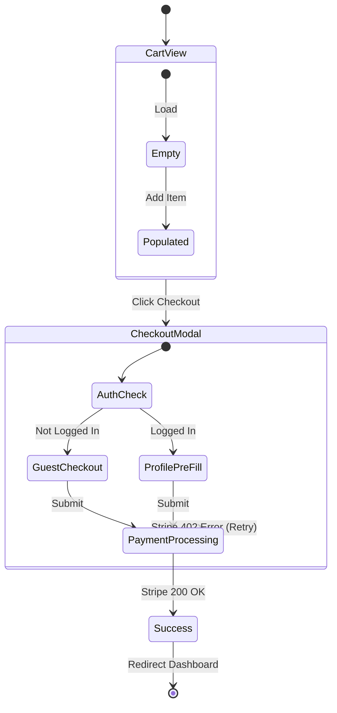

# Appflow & Wireframing — Visualization Mastery

## Mandatory Pre-Flight Context Inspection
Before reading, generating, or refactoring code in the `appflow-wireframe` domain, inspect these 5 critical parameters:
1. **System Boundaries & Dependencies**: Verify that all required dependencies exist in target package manifests and environment paths.
2. **Runtime Context & Platform Invariants**: Confirm target platform constraints (Node.js, Browser, Mobile OS, Edge runtime) before applying APIs.
3. **Execution Guardrails**: Identify potential side-effects, state mutations, and unhandled asynchronous exceptions.
4. **Validation & Type Contracts**: Validate input data schemas and strict type constraints across all module interfaces.
5. **Observability & Proof of Execution**: Ensure execution produces tangible verification signals (terminal output, tests, metrics).


## Activation Boundaries
- **Activate when:** Use when building, styling, optimizing, and auditing appflow wireframe components, responsive layouts, design systems, and frontend state.
- **DO NOT activate when:** The task falls outside the `appflow-wireframe` domain or is managed by a different dedicated specialist agent.


## 🔁 Multi-Pass Execution Protocol

| Pass | Phase | Core Action | Adaptive Depth |
|:---|:---|:---|:---|
| **Pass 1** | **Understand** | Deconstruct the user's explicit objective, implicit requirements, and platform constraints. | Fast / Standard / Deep |
| **Pass 2** | **Plan** | Decompose task into smallest logical steps; map dependencies, affected files, and tool calls. | Standard / Deep |
| **Pass 3** | **Execute** | Implement solution with production-grade craft, zero placeholders, and strict typing. | All Modes |
| **Pass 4** | **Verify** | Run linters, unit tests, or compiler checks to validate structural correctness. | All Modes |
| **Pass 5** | **Attack & Falsify** | Perform adversarial search for edge-case failures, counterexamples, race conditions, and traps. | Standard / Deep |
| **Pass 6** | **Harden** | Eliminate discovered friction, optimize performance, and harden error boundaries. | Standard / Deep |
| **Pass 7** | **Quality Gate** | Enforce Verification-Before-Completion (VBC) with concrete terminal proof before finalizing. | All Modes |


---

## 🛠️ Technical Architecture & Reference Recipes

## Hallucination Traps (Read First)

---
## 1. The Mermaid Appflow Protocol

When asked to "design the flow", do not write prose. Write deterministic Mermaid diagrams that map state interactions.

### Example: E-Commerce Checkout Flow


```mermaid
stateDiagram-v2
    [*] --> CartView

    state CartView {
        [*] --> Empty: Load
        Empty --> Populated: Add Item
    }

    CartView --> CheckoutModal: Click Checkout

    state CheckoutModal {
        [*] --> AuthCheck
        AuthCheck --> GuestCheckout: Not Logged In
        AuthCheck --> ProfilePreFill: Logged In

        GuestCheckout --> PaymentProcessing: Submit
        ProfilePreFill --> PaymentProcessing: Submit
    }

    PaymentProcessing --> Success: Stripe 200 OK
    PaymentProcessing --> CheckoutModal: Stripe 402 Error (Retry)

    Success --> [*]: Redirect Dashboard
```

---

## 2. Low-Fidelity Wireframe Notation

When asked to define the UI layout conceptually before building Shadcn/Tailwind components, use structural ASCII/Markdown notation to establish layout boundaries.

```text
[ HEADER: Logo (Left) | Search Bar (Center, expanding) | User Avatar (Right) ]
-------------------------------------------------------------------------
[ SIDEBAR (Sticky, W-64) ] |  [ HERO SECTION: H1 Hook | CTA Button Primary ]
- Dashboard                |  [ .......................................... ]
- Analytics                |  [ FEATURE GRID (CSS Grid columns-3)        ]
- Settings                 |  [ [Card 1]     [Card 2]      [Card 3]      ]
[........................] |  [..........................................]
```

**Why do this?**
Because moving an ASCII box takes 3 seconds. Rewriting 4 nested div flexbox tails takes 5 minutes. Secure the approval on the wireframe before touching code.

---

## 3. The Empty State / Loading State Mandate

When mapping application flows, AI frequently charts the "Happy Path" (User logs in -> User sees 10 items).

Every single screen designed in an App Flow MUST explicitly define:

1. **The Loading State:** What does the user see while the network executes? (Skeleton loaders vs Spinners).
2. **The Empty State:** What does the UI look like on Day 1 when the user has zero data? (An empty white screen is an instant bounce-rate death sentence; use an Empty State CTA).

---

## 4. Interaction Matrices (Event Mapping)

Before writing React, chart exactly what the user can do on the screen and what the system does in response.

| Interaction         | Trigger                | System Response Hook         | Edge Case                      |
| :------------------ | :--------------------- | :--------------------------- | :----------------------------- |
| Click `Add to Cart` | `onClick`              | Dispatch `Zustand.add(item)` | If out of stock, render Toast  |
| Scroll to Bottom    | `IntersectionObserver` | `fetchNextPage()`            | Reached max items, show footer |
| Click outside Modal | `useClickAway`         | `setIsOpen(false)`           | Prevent close if form is dirty |

## 🚨 Edge-Case & Failure Mode Matrix

| Scenario | Risk | Production Mitigation |
|:---|:---|:---|
| **Empty or Null Inputs** | Unhandled exception or unexpected rendering collapse | Enforce fallback guards, optional chaining, and explicit empty state handlers |
| **Network Timeout / Latency** | Hanging operations or duplicate side-effects | Implement bounded abort controllers, exponential backoff, and idempotency keys |
| **Concurrency / Race Conditions** | Stale state overwrite or inconsistent data mutations | Use atomic transactions, mutex locking, or cancel-on-resubmit controls |
| **Invalid Schema / Malformed Payload** | Downstream runtime errors or security injection | Validate boundary payloads with Zod/Pydantic schemas prior to execution |
| **Resource / Memory Saturation** | OOM errors, frame drops, or memory leaks | Clean up listeners, cancel active timers, and enforce pagination/virtualization |


## 🏛️ Tribunal Verification & Guardrails

**Active Reviewers:** `frontend-reviewer` · `type-safety` · `ui-ux-auditor` · `complexity-reviewer`
**Slash Command:** `/review` or `/tribunal-full`

### 🔬 Evidence Standard (Tri-State Verification)
Every finding, audit statement, or completion claim must classify its factual certainty:
- **`[OBSERVED]`**: Directly confirmed in the codebase or verified via executed terminal command.
- **`[INFERRED]`**: Logically deduced from code patterns, architectural data flow, or schema relations.
- **`[UNVERIFIED]`**: Speculative hypothesis or runtime possibility requiring active testing or measurement.

### ✅ Pre-Flight Self-Audit Checklist
```
✅ Are all component props strictly typed with zero implicit "any"?
✅ Are responsive breakpoints, fluid typography, and optical balance verified?
✅ Is accessibility (ARIA labels, keyboard navigation, contrast ratio >= 4.5:1) validated?
✅ Are re-renders minimized and state lifecycles cleanly separated?
✅ Did I verify all imported UI components and icon sets actually exist?
```

### 🛑 Verification-Before-Completion (VBC) Protocol
**CRITICAL:** You must follow a strict "evidence-based closeout" state machine.
- ❌ **Forbidden:** Declaring a task complete because the output "looks correct."
- ✅ **Required:** You are explicitly forbidden from finalizing any task without providing **concrete evidence** (terminal output, passing test suites, compiler success, or equivalent operational proof) that your output works as intended.
