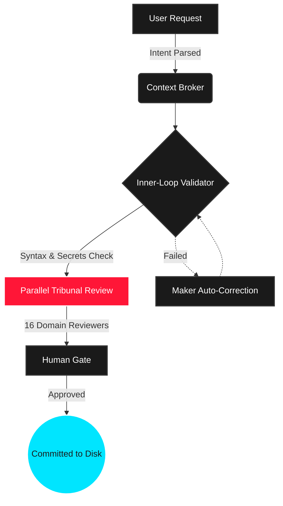

<div align="center">
  <picture>
    
  </picture>

  <br>

  <h1>TRIBUNAL KIT</h1>
  <p><b>Anti-Hallucination Agent Architecture • Long-Running Autonomy • Pipeline Scrutiny</b></p>

  [](https://www.npmjs.com/package/tribunal-kit)
  [](LICENSE)
  [](CHANGELOG.md)
  [](mcp_config.json)
</div>

---

> [!IMPORTANT]
> **AI GENERATES CODE. TRIBUNAL ENSURES IT WORKS.**  
> A zero-bloat `.agent/` intelligence payload that upgrades your IDE with **41 specialist agents**, **31 workflows**, and a **16-reviewer Tribunal pipeline**. Zero hallucinations. Absolute execution certainty.

## ▓▒░ QUICK START

Drop Tribunal into any existing project to instantly weaponize your IDE.

```bash
# Pull the intelligence payload into your project directory
npx tribunal-kit init
```

> [!NOTE]
> `init` automatically generates bridge rules for **Cursor**, **Windsurf**, **Gemini**, **Copilot**, and **Claude**. No configuration required.

### 🔄 Auto-Syncing IDEs
Keep your entire team aligned. Run `npx tribunal-kit sync` to instantly push the latest `.agent` rules directly into your IDE config files. Use `npx tribunal-kit hook` to install a Git `pre-push` hook that auto-evolves and syncs rules every time you push code.

<br>

## ▓▒░ THE MARATHON HARNESS (v4.4.4)

The v4.4 update introduces the **Marathon Harness**—an engine designed to keep autonomous agents on track during long-running, multi-session projects without looping or losing context.

### ⛓️ Directed Acyclic Graph (DAG) Support
Cascade failures are obsolete. Features can now be declared with dependencies (`--deps=1,2`). If a database schema task fails, the API route task is automatically flagged as **Deadlocked** and bypassed until the root issue is resolved.

### 🧠 Failure Context & Attempt Tracking
Agents no longer blindly retry failed approaches. When a feature fails, the reason and attempt count are permanently logged into the state matrix. The next agent to attempt the feature receives the exact failure history to course-correct immediately.

### 🔮 Memory Distillation
Context windows dilute over time. The new `distill` command allows agents to forge crucial architectural decisions into a permanent `distilled_context.md` memory matrix, bridging the amnesia gap between long work sessions.

### 🎨 Native Swarm Dashboard
When dispatching parallel tasks via `/swarm`, Tribunal now intercepts the noisy terminal output and renders a sleek, zero-dependency **ANSI TUI Dashboard**. Watch multiple agents research, generate, and review in real-time.

<br>

## ▓▒░ THE PIPELINE // EVIDENCE-BASED CLOSEOUT

Code generation is solved. **Code correctness is the frontier.** 



<br>

## ▓▒░ THE SUPREME COURT (CASE LAW ENGINE)

The Tribunal Kit features persistent memory. The AI **never makes the same mistake twice** and auto-learns your engineering culture.

> [!WARNING]
> **1. The Case Law Engine**
> Record mistakes as legal precedent. The `precedence-reviewer` checks this database locally to forcefully block the AI from repeating banned patterns.
> - `npx tribunal-kit case add` *(Record an AI hallucination)*

> [!TIP]
> **2. Skill Evolution Forge**
> Stop writing manual rules. The system reads your Git diffs, strips token bloat, and auto-extracts your project's architectural idioms.
> - `npx tribunal-kit learn` *(Digest staged files)*

## ▓▒░ NATIVE MCP SERVER

Tribunal-Kit now functions as a standalone **Model Context Protocol (MCP)** server via `stdio`. 

Bind your AI IDE (Cursor, Claude Desktop, etc.) directly to `tribunal-kit` to unlock autonomous tool execution:
- `run_tribunal_audit`: AI can trigger a full workspace health check.
- `search_case_law`: AI can query your project's historical code rejections to avoid making mistakes *before* it writes code.
- `sync_ide_bridges`: Force rule alignment directly from the AI chat.

<br>

## ▓▒░ COMMAND ARSENAL

| Slash Command | Operational Scope |
| :--- | :--- |
| `/generate` | Full Tribunal sequence: Generate → Audit → Human Gate. |
| `/create` | Scaffold major applications via App Builder routing. |
| `/enhance` | Safely extend existing codebases with zero regression. |
| `/swarm` | Fan-out orchestrator. Dispatch isolated workers, synthesize output. |
| `/tribunal-full` | Unleash **ALL 16** domain reviewers simultaneously for maximum scrutiny. |
| `/debug` | Systematic 4-phase root-cause investigation. No guessing. |
| `/ui-ux-pro-max` | Advanced visual aesthetic engine. No generic AI slop. |

<br>

<div align="center">
  <br>
  
  <br><br>
  <i>"Never guess database column names. Error handling on every async function. Evidence-based closeouts. Welcome to the Tribunal."</i><br>
  <sub><b>MIT Licensed</b> • Engineered for maximum autonomy and precision.</sub>
</div> 
