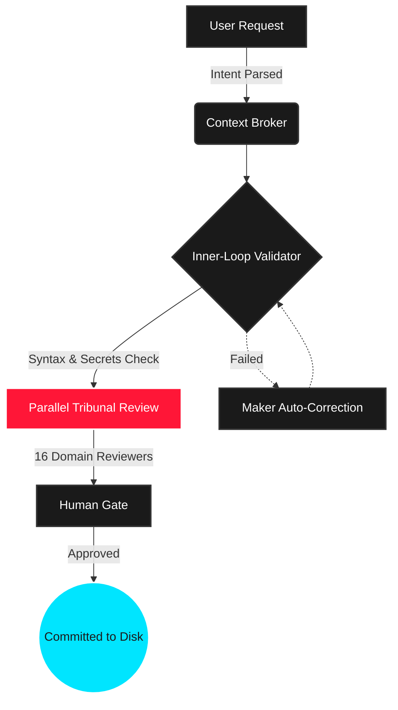

<div align="center">
  <picture>
    
  </picture>

<br><br>

  <h1 style="font-size: 2.5em; border-bottom: none; margin-bottom: 0;">TRIBUNAL KIT</h1>
  <p style="font-size: 1.2em; color: #888;">
    <b>Anti-Hallucination Agent Architecture • Long-Running Autonomy • Pipeline Scrutiny</b>
  </p>

  <br>

[](https://www.npmjs.com/package/tribunal-kit)
[](LICENSE)
[](CHANGELOG.md)
[](mcp_config.json)
[](AGENT_FLOW.md)

<br><br>

</div>

> [!IMPORTANT]
> **AI GENERATES CODE. TRIBUNAL ENSURES IT WORKS.**  
> A zero-bloat `.agent/` intelligence payload that upgrades your IDE with **40 specialist agents**, **34 workflows**, and a **16-reviewer Tribunal pipeline**. Zero hallucinations. Absolute execution certainty.

<br>

<div align="center">
  
</div>

## 🚀 QUICK START

Drop Tribunal into any existing project to instantly weaponize your IDE.

```bash
# Pull the intelligence payload into your project directory
npx tribunal-kit init
```

> [!NOTE]
> <kbd>init</kbd> automatically generates bridge rules for **Cursor**, **Windsurf**, **Gemini**, **Copilot**, and **Claude**. No configuration required.

### 🔄 Auto-Syncing IDEs

Keep your entire team aligned. Run <kbd>npx tribunal-kit sync</kbd> to instantly push the latest `.agent` rules directly into your IDE config files. Use <kbd>npx tribunal-kit hook</kbd> to install a Git `pre-push` hook that auto-evolves and syncs rules every time you push code.

<br>

## ⚡ STATE-OF-THE-ART PERFORMANCE (v5.0)

Tribunal-Kit v5 is rebuilt from the ground up to be blazingly fast. We've eliminated initialization latency and blocking I/O:

- **Native Rust Core Engine**: The CLI parser and critical paths are now powered by a compiled `tokio`-based Rust binary (`tribunal-core`).
- **Parallel I/O Processing**: File copies and bridge generation run concurrently with bounded thread pools (Semaphore concurrency: 64 in Rust, 32 in JS).
- **Zero-Latency Updates**: `init --force` now uses SHA-256 hash manifesting. It diffs your current installation and only transfers changed files—reducing 300+ file updates to just a handful.
- **In-Process MCP Routing**: `mcp-server.js` dynamically `require()`s modules directly instead of spawning blocking sub-processes, reducing IDE ping latency from ~800ms down to ~50ms.
- **Lazy-Loaded Architecture**: The JavaScript CLI now lazy-loads commands on demand, cutting parsing overhead by 70%.

With Tribunal-Kit 5.0, your intelligence payload deploys practically instantaneously.

<br>

<div align="center">
  
</div>

## ⚔️ THE COMMAND ARSENAL

| Workflow Command          | Operational Scope                                                        |
| :------------------------ | :----------------------------------------------------------------------- |
| <kbd>/generate</kbd>      | Full Tribunal sequence: Generate → Audit → Human Gate.                   |
| <kbd>/create</kbd>        | Scaffold major applications via App Builder routing.                     |
| <kbd>/enhance</kbd>       | Safely extend existing codebases with zero regression.                   |
| <kbd>/swarm</kbd>         | Fan-out orchestrator. Dispatch isolated workers, synthesize output.      |
| <kbd>/tribunal-full</kbd> | Unleash **ALL 16** domain reviewers simultaneously for maximum scrutiny. |
| <kbd>/debug</kbd>         | Systematic 4-phase root-cause investigation. No guessing.                |
| <kbd>/ui-ux-pro-max</kbd> | Advanced visual aesthetic engine. No generic AI slop.                    |

<br>

<div align="center">
  
</div>

## ⚖️ THE PIPELINE // EVIDENCE-BASED CLOSEOUT

Code generation is solved. **Code correctness is the frontier.**



<br>

<div align="center">
  
</div>

## 🏛️ THE SUPREME COURT (CASE LAW ENGINE)

The Tribunal Kit features persistent memory. The AI **never makes the same mistake twice** and auto-learns your engineering culture.

> [!WARNING]
>
> ### 1. The Case Law Engine
>
> Record mistakes as legal precedent. The `precedence-reviewer` checks this database locally to forcefully block the AI from repeating banned patterns.
>
> - <kbd>npx tribunal-kit case add</kbd> _(Record an AI hallucination)_

> [!TIP]
>
> ### 2. Skill Evolution Forge
>
> Stop writing manual rules. The system reads your Git diffs, strips token bloat, and auto-extracts your project's architectural idioms.
>
> - <kbd>npx tribunal-kit learn</kbd> _(Digest staged files)_

<br>

<div align="center">
  
</div>

## 🏃 THE MARATHON HARNESS (v4.4+)

The **Marathon Harness** is an engine designed to keep autonomous agents on track during long-running, multi-session projects without looping or losing context.

<table>
  <tr>
    <td width="50%">
      <h3>⛓️ DAG Support</h3>
      <p>Cascade failures are obsolete. Features can now be declared with dependencies (<code>--deps=1,2</code>). If a database schema task fails, the API route task is automatically flagged as <b>Deadlocked</b> and bypassed until the root issue is resolved.</p>
    </td>
    <td width="50%">
      <h3>🧠 Memory Distillation</h3>
      <p>Context windows dilute over time. The new <code>distill</code> command allows agents to forge crucial architectural decisions into a permanent <code>distilled_context.md</code> memory matrix, bridging the amnesia gap between long work sessions.</p>
    </td>
  </tr>
  <tr>
    <td width="50%">
      <h3>📊 Native Swarm Dashboard</h3>
      <p>When dispatching parallel tasks via <kbd>/swarm</kbd>, Tribunal intercepts the noisy terminal output and renders a sleek, zero-dependency <b>ANSI TUI Dashboard</b>. Watch agents research, generate, and review in real-time.</p>
    </td>
    <td width="50%">
      <h3>🔮 Failure Context Tracking</h3>
      <p>Agents no longer blindly retry failed approaches. When a feature fails, the reason and attempt count are permanently logged. The next agent receives the exact failure history to course-correct immediately.</p>
    </td>
  </tr>
</table>

<br>

<div align="center">
  
</div>

## 🔌 NATIVE MCP SERVER

Tribunal-Kit functions as a standalone **Model Context Protocol (MCP)** server via `stdio`.

Bind your AI IDE directly to `tribunal-kit` to unlock autonomous tool execution:

- `run_tribunal_audit`: AI can trigger a full workspace health check.
- `search_case_law`: AI can query your project's historical code rejections to avoid making mistakes _before_ it writes code.
- `sync_ide_bridges`: Force rule alignment directly from the AI chat.

<br>

<div align="center">
  
  <br><br>
  <i>"Never guess database column names. Error handling on every async function. Evidence-based closeouts. Welcome to the Tribunal."</i><br>
  <sub><b>MIT Licensed</b> • Engineered for maximum autonomy and precision.</sub>
</div>
