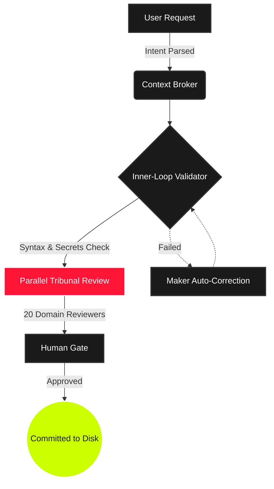

<div align="center">
  <picture>
    
  </picture>

  <h1 style="font-size: 3em; font-weight: 800; letter-spacing: -1px; margin-bottom: 0;">TRIBUNAL KIT</h1>
  <p style="font-size: 1.1em; color: #888; text-transform: uppercase; letter-spacing: 2px;">
    <b>Anti-Hallucination Pipeline • Long-Running Autonomy • Absolute Control</b>
  </p>

  <br>

[](https://www.npmjs.com/package/tribunal-kit)
[](LICENSE)
[](CHANGELOG.md)
[](mcp_config.json)
[](AGENT_FLOW.md)
[](https://ko-fi.com/Y6C122DUQJ)

</div>

<br>

> [!IMPORTANT]
> **AI GENERATES CODE. TRIBUNAL ENSURES IT WORKS.**  
> A zero-bloat `.agent/` intelligence payload and **Model Context Protocol (MCP) server** that upgrades your IDE (**Cursor**, **VSCode**, **Windsurf**) and terminal AI coding assistants (**Claude Code**, **Aider**) with **43 specialist agents**, **34 workflows**, and a parallel **20-reviewer Tribunal pipeline**. Maximizes execution reliability, optimizes context windows, and heavily mitigates AI code hallucinations.

<br>
<hr style="border: 1px solid #222; margin: 40px 0;">
<br>

## 📋 Table of Contents

- [🚀 Quick Start — Setting Up your AI Agent Code Review Engine](#-quick-start--setting-up-your-ai-agent-code-review-engine)
- [⚡ State-of-the-Art Performance (Tokio Rust Core)](#-state-of-the-art-performance-tokio-rust-core)
- [⚔️ The Command Arsenal — Swarms & Agentic Workflows](#️-the-command-arsenal--swarms--agentic-workflows)
- [💻 CLI Command Reference](#-cli-command-reference)
- [⚖️ The Tribunal Pipeline — Mitigating AI Code Hallucinations](#️-the-tribunal-pipeline--mitigating-ai-code-hallucinations)
- [🏛️ The Supreme Court Case Law Engine — Persistent Memory for AI Coding](#️-the-supreme-court-case-law-engine--persistent-memory-for-ai-coding)
- [🏃 The Marathon Harness — Long-Running Autonomous AI Agents](#-the-marathon-harness--long-running-autonomous-ai-agents)
- [🧠 Advanced Capabilities & System Prompt Rules (v5.8)](#-advanced-capabilities--system-prompt-rules-v58)
- [🔌 Model Context Protocol (MCP) Server for Cursor, VSCode & Windsurf](#-model-context-protocol-mcp-server-for-cursor-vscode--windsurf)
- [❓ Frequently Asked Questions (FAQ)](#-frequently-asked-questions-faq)

<br>
<hr style="border: 1px solid #222; margin: 40px 0;">
<br>

## 🚀 Quick Start — Setting Up your AI Agent Code Review Engine

Drop Tribunal into any existing project to instantly weaponize your IDE.

```bash
# Pull the intelligence payload into your project directory
npx tribunal-kit init
```

> [!NOTE]
> <kbd>init</kbd> automatically generates bridge rules for **Cursor**, **Windsurf**, **Gemini**, **Copilot**, and **Claude**. No configuration required.

### 🔄 Auto-Syncing IDEs
Keep your entire team aligned. Run <kbd>npx tribunal-kit sync</kbd> to instantly push the latest `.agent` rules directly into your IDE config files. Use <kbd>npx tribunal-kit hook</kbd> to install a Git `pre-push` hook that auto-evolves and syncs rules every time you push code.

### 💻 Terminal Agent Support (Claude Code, Aider, OpenCode)
Tribunal Kit breaks out of the IDE with first-class support for terminal-based AI agents.
- **Dynamic MCP Integration**: Modern agents can connect to Tribunal via MCP (Model Context Protocol) to dynamically fetch only the specific skills and agents they need without blowing up the context window.
- **Static Compilation**: Run <kbd>tk compile</kbd> to statically generate a `.tribunal-compiled.md` file for terminal tools that require static context files.

<br>
<hr style="border: 1px solid #222; margin: 40px 0;">
<br>

## ⚡ State-of-the-Art Performance (Tokio Rust Core)

Tribunal-Kit v5 is rebuilt from the ground up to be blazingly fast. We've eliminated initialization latency and blocking I/O:

- **Native Rust Core Engine**: The CLI parser and critical paths are powered by a compiled `tokio`-based Rust binary (`tribunal-core`).
- **Parallel I/O Processing**: File copies and bridge generation run concurrently with bounded thread pools (Semaphore concurrency: 64 in Rust, 32 in JS).
- **Zero-Latency Updates**: `init --force` uses SHA-256 hash manifesting. It diffs your current installation and only transfers changed files.
- **In-Process MCP Routing**: `mcp-server.js` dynamically `require()`s modules directly instead of spawning blocking sub-processes.
- **Lazy-Loaded Architecture**: The JavaScript CLI now lazy-loads commands on demand, cutting parsing overhead by 70%.

<br>
<hr style="border: 1px solid #222; margin: 40px 0;">
<br>

## ⚔️ The Command Arsenal — Swarms & Agentic Workflows

| Workflow Command          | Operational Scope                                                        |
| :------------------------ | :----------------------------------------------------------------------- |
| <kbd>/generate</kbd>      | Full Tribunal sequence: Generate → Audit → Human Gate.                   |
| <kbd>/create</kbd>        | Scaffold major applications via App Builder routing.                     |
| <kbd>/enhance</kbd>       | Safely extend existing codebases with zero regression.                   |
| <kbd>/swarm</kbd>         | Fan-out orchestrator. Dispatch isolated workers, synthesize output.      |
| <kbd>/tribunal-full</kbd> | Unleash **ALL 20** domain reviewers simultaneously for maximum scrutiny. |
| <kbd>/debug</kbd>         | Systematic 4-phase root-cause investigation. No guessing.                |
| <kbd>/ui-ux-pro-max</kbd> | Advanced visual aesthetic engine. No generic AI slop.                    |

<br>
<hr style="border: 1px solid #222; margin: 40px 0;">
<br>

## 💻 CLI Command Reference

You can run Tribunal commands using `npx tribunal-kit <command>` (or the short alias `tk <command>` if installed globally/locally).

### Core Commands
*   **`init`**: Initialize the `.agent/` configuration payload in the current directory.
    ```bash
    npx tribunal-kit init [--force] [--path <dir>] [--minimal] [--dry-run]
    ```
*   **`status`**: Check the status and integrity of the `.agent/` directory.
    ```bash
    npx tribunal-kit status
    ```
*   **`update`**: Re-install or refresh to pull the latest agent configurations into the project.
    ```bash
    npx tribunal-kit update
    ```
*   **`sync`**: Instantly synchronize the latest `.agent` rules directly with local IDE config files (Cursor, Windsurf, Copilot, VSCode, Gemini).
    ```bash
    npx tribunal-kit sync
    ```
*   **`hook`**: Install or configure Git `pre-push` hooks to auto-sync rules on push.
    ```bash
    npx tribunal-kit hook
    ```
*   **`compile`**: Compile static context rules into a `.tribunal-compiled.md` file for terminal agents.
    ```bash
    npx tribunal-kit compile
    ```
*   **`uninstall`**: Cleanly remove `.agent/` from the target project.
    ```bash
    npx tribunal-kit uninstall [--path <dir>]
    ```

### Case Law Engine (`case`)
Manage the Supreme Court Case Law database to prevent AI hallucinations.
*   **`case add`**: Interactively record a new AI mistake/precedent.
*   **`case list`**: List all recorded precedence entries.
*   **`case search "<query>"`**: Search historical cases.
*   **`case show --id <id>`**: Show details of a specific case.
*   **`case stats`**: Display statistics on case counts and types.
*   **`case export`**: Export database to a readable `.agent/history/case-law/CASE_LAW.md`.
*   **`case overrule --id <id>`**: Remove/overrule a case entry.

### Memory Engine (`memory`)
Manage the 4-Type Taxonomy Persistent Memory Engine.
*   **`memory store`**: Store a tagged memory (`semantic`, `procedural`, `episodic`, or `working`).
    ```bash
    npx tribunal-kit memory store --type semantic --content "Uses PostgreSQL" --tags "db"
    ```
*   **`memory recall`**: Recall budget-gated memories.
    ```bash
    npx tribunal-kit memory recall --query "postgres" --budget 1000
    ```
*   **`memory gc`**: Garbage collect expired episodic and all working memories.
*   **`memory stats`**: Show memory index statistics.
*   **`memory export`**: Export the human-readable `MEMORY.md` index projection.

### Codebase Graphs & Context
*   **`graph`**: Analyze codebase dependencies, generate architecture graphs, and build context snapshots.
    ```bash
    npx tribunal-kit graph
    ```
*   **`context <file>`**: Read and inspect a specific context snapshot for a given file.
    ```bash
    npx tribunal-kit context src/utils.js
    ```
*   **`mutate <file> "<test-cmd>"`**: Run mutation testing on a file to verify test suite robustness.
    ```bash
    npx tribunal-kit mutate src/utils.js "npm test"
    ```

### Learning & Evolving
*   **`learn`**: Evolve your project's custom skills and architectural idioms by reading git diffs.
    ```bash
    npx tribunal-kit learn [--dry-run] [--head]
    ```

### Marathon Long-Running Harness (`marathon`)
Run long-running, multi-session tasks tracked inside the feature DAG.
*   **`marathon init "<spec>"`**: Start a new long-running task.
*   **`marathon status`**: Show interactive progress dashboard.
*   **`marathon next`**: Print next incomplete feature task.
*   **`marathon mark <id> <pass|fail>`**: Mark a specific feature status.
*   **`marathon log "<note>"`**: Append a progress log.
*   **`marathon session-start` / `session-end`**: Manage session contexts.

<br>
<hr style="border: 1px solid #222; margin: 40px 0;">
<br>

## ⚖️ The Tribunal Pipeline — Mitigating AI Code Hallucinations

Code generation is solved. **Code correctness is the frontier.**



<br>
<hr style="border: 1px solid #222; margin: 40px 0;">
<br>

## 🏛️ The Supreme Court Case Law Engine — Persistent Memory for AI Coding

The Tribunal Kit features persistent memory. The AI **never makes the same mistake twice** and auto-learns your engineering culture.

> [!WARNING]
> ### 1. The Case Law Engine
> Record mistakes as legal precedent. The `precedence-reviewer` checks this database locally to forcefully block the AI from repeating banned patterns.
> - <kbd>npx tribunal-kit case add</kbd> _(Record an AI hallucination)_

> [!TIP]
> ### 2. Skill Evolution Forge
> Stop writing manual rules. The system reads your Git diffs, strips token bloat, and auto-extracts your project's architectural idioms.
> - <kbd>npx tribunal-kit learn</kbd> _(Digest staged files)_

<br>
<hr style="border: 1px solid #222; margin: 40px 0;">
<br>

## 🏃 The Marathon Harness — Long-Running Autonomous AI Agents

The **Marathon Harness** is an engine designed to keep autonomous agents on track during long-running, multi-session projects without looping or losing context.

<table>
  <tr>
    <td width="50%">
      <h3>⛓️ DAG Support</h3>
      <p>Cascade failures are obsolete. Features can now be declared with dependencies (<code>--deps=1,2</code>). If a database schema task fails, the API route task is automatically flagged as <b>Deadlocked</b> and bypassed until the root issue is resolved.</p>
    </td>
    <td width="50%">
      <h3>🧠 Memory Distillation</h3>
      <p>Context windows dilute over time. The new <code>distill</code> command allows agents to forge crucial architectural decisions into a permanent <code>distilled_context.md</code> memory matrix, bridging the amnesia gap between long work sessions.</p>
    </td>
  </tr>
  <tr>
    <td width="50%">
      <h3>📊 Native Swarm Dashboard</h3>
      <p>When dispatching parallel tasks via <kbd>/swarm</kbd>, Tribunal intercepts the noisy terminal output and renders a sleek, zero-dependency <b>ANSI TUI Dashboard</b>. Watch agents research, generate, and review in real-time.</p>
    </td>
    <td width="50%">
      <h3>🔮 Failure Context Tracking</h3>
      <p>Agents no longer blindly retry failed approaches. When a feature fails, the reason and attempt count are permanently logged. The next agent receives the exact failure history to course-correct immediately.</p>
    </td>
  </tr>
</table>

<br>
<hr style="border: 1px solid #222; margin: 40px 0;">
<br>

## 🧠 Advanced Capabilities & System Prompt Rules (v5.8)

The 5.8 update introduces a massive leap in long-running agent capabilities and code correctness:

- **Persistent Memory Engine (4-Type Taxonomy)**: Agents now categorize memory into Semantic, Procedural, Episodic, and Working memory, using budget-gated recall to completely eliminate context window bloat over multi-day tasks.
- **Dependency Ladder Enforcement**: Automatically prevents over-engineering and architectural bloat through strict 6-rung dependency analysis before any new packages are introduced.
- **Skill Variance Tracking**: The system now self-evaluates custom skills by running benchmark prompts (Edge case, Standard, Malicious) and generating performance matrices.
- **Complex Artifact Protocol**: Upgraded agents with strict rules forbidding single-file monoliths for complex artifacts, enforcing proper component splitting and routing/state conventions.

<br>
<hr style="border: 1px solid #222; margin: 40px 0;">
<br>

## 🔌 Model Context Protocol (MCP) Server for Cursor, VSCode & Windsurf

Tribunal-Kit functions as a standalone **Model Context Protocol (MCP)** server via `stdio`.

Bind your AI IDE directly to `tribunal-kit` to unlock autonomous tool execution:

- `run_tribunal_audit`: AI can trigger a full workspace health check.
- `search_case_law`: AI can query your project's historical code rejections to avoid making mistakes _before_ it writes code.
- `sync_ide_bridges`: Force rule alignment directly from the AI chat.
- `list_tribunal_agents` & `get_tribunal_skill`: Terminal agents can dynamically fetch specific skills without overloading their context windows.

<br>
<hr style="border: 1px solid #222; margin: 40px 0;">
<br>

## ❓ Frequently Asked Questions (FAQ)

### How does Tribunal-Kit prevent AI hallucinations?
Tribunal-Kit introduces a systematic, multi-reviewer pipeline called the **Tribunal Review**. When an AI agent generates code, it routes that code through up to 20 specialized domain reviewers (e.g., security, logic, schema) and verifies it against local tests and lint rules before presenting it to the developer.

### Which IDEs and AI tools are supported by Tribunal-Kit?
Tribunal-Kit natively supports and automatically syncs rules with **Cursor**, **Windsurf**, **VSCode**, **Gemini**, **Copilot**, and **Claude Desktop**. It also supports terminal-based agents like **Claude Code**, **Aider**, and **OpenCode** via Model Context Protocol (MCP) or compiled static context files.

### How do I connect Claude Code or Aider to Tribunal-Kit via MCP?
Tribunal-Kit includes a built-in Model Context Protocol (MCP) server. You can configure your AI assistant (like Claude Desktop or Claude Code) to spawn `node bin/wrapper.js` as an MCP server. This allows the AI agent to dynamically fetch custom skills, search the local case law precedence database, and run audits on demand.

### What is the Supreme Court Case Law Engine?
It is a local, lightweight database that records past AI mistakes as legal precedent. Before code generation is committed, the `precedence-reviewer` queries this database to prevent the AI from repeating known codebase anti-patterns.

<br>
<br>

<div align="center">
  
  <br><br>
  <i>"Never guess database column names. Error handling on every async function. Evidence-based closeouts. Welcome to the Tribunal."</i><br>
  <sub><b>MIT Licensed</b> • Engineered for maximum autonomy and precision.</sub>
</div>
