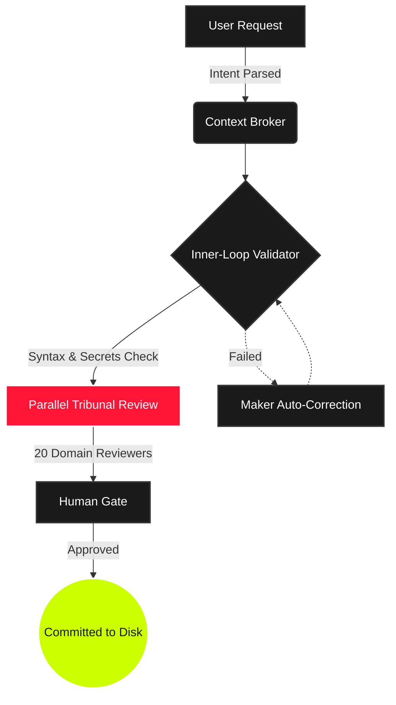

<!-- PROJECT HEADER -->
<div align="center">
  <br>
  
  
  <h1 style="font-size: 3.25em; font-weight: 800; letter-spacing: -2px; margin: 0; color: #ffffff; font-family: -apple-system, BlinkMacSystemFont, 'Segoe UI', Roboto, sans-serif;">
    TRIBUNAL KIT
  </h1>
  
  <p style="font-size: 1.15em; color: #88888b; font-weight: 500; letter-spacing: 3px; margin: 10px 0 25px 0; text-transform: uppercase;">
    The Operating System for AI Software Engineering
  </p>

  <!-- BADGES -->
  <div style="margin-bottom: 30px;">
    <a href="https://www.npmjs.com/package/tribunal-kit">
      
    </a>
    <a href="LICENSE">
      
    </a>
    <a href="CHANGELOG.md">
      
    </a>
    <a href="mcp_config.json">
      
    </a>
    <a href="SECURITY.md">
      
    </a>
  </div>
</div>

<br>

<!-- INTRO KEYNOTE -->
<div style="background: linear-gradient(145deg, #111115, #16161c); border: 1px solid #22222a; border-radius: 12px; padding: 24px; margin-bottom: 40px; box-shadow: 0 4px 20px rgba(0, 0, 0, 0.25);">
  <div style="display: flex; align-items: center; margin-bottom: 12px;">
    <span style="background-color: #ff1637; color: white; padding: 4px 8px; border-radius: 4px; font-size: 0.75em; font-weight: bold; text-transform: uppercase; letter-spacing: 1px; margin-right: 10px;">Security Envelope</span>
    <strong style="color: #ffffff; font-size: 1.1em;">AI GENERATES CODE. TRIBUNAL KIT GOVERNS IT.</strong>
  </div>
  <p style="color: #c9c9d1; font-size: 0.95em; line-height: 1.6; margin: 0;">
    A zero-bloat <strong>.agent/</strong> intelligence payload and <strong>Model Context Protocol (MCP) server</strong> that upgrades your IDEs (<a href="#" style="color: #ccff00; text-decoration: none;">Cursor</a>, <a href="#" style="color: #ccff00; text-decoration: none;">VSCode</a>, <a href="#" style="color: #ccff00; text-decoration: none;">Windsurf</a>) and terminal AI coding assistants (<a href="#" style="color: #ccff00; text-decoration: none;">Claude Code</a>, <a href="#" style="color: #ccff00; text-decoration: none;">Aider</a>) with <strong>44 specialist agents</strong>, <strong>34 workflows</strong>, and a parallel <strong>20-reviewer Tribunal pipeline</strong>. Establishes absolute runtime correctness, optimizes context windows, and heavily mitigates AI code hallucinations.
  </p>
</div>

<hr style="height: 1px; border: none; background: linear-gradient(to right, transparent, #33333f, transparent); margin: 40px 0;" />

<!-- TABLE OF CONTENTS -->
<details style="background: #111115; border: 1px solid #222225; border-radius: 8px; padding: 12px 18px; margin-bottom: 45px;">
  <summary style="font-weight: 600; color: #ffffff; cursor: pointer; user-select: none; font-size: 1.05em;">
    📂 Table of Contents (Click to Expand)
  </summary>
  <div style="margin-top: 15px; padding-left: 10px;">
    <ul style="list-style-type: none; padding-left: 0; line-height: 1.8;">
      <li>👉 <a href="#-the-competitive-advantage" style="color: #a0a0a5; text-decoration: none;">Why Tribunal Kit? (The Competitive Advantage)</a></li>
      <li>👉 <a href="#-comparative-analysis" style="color: #a0a0a5; text-decoration: none;">Comparative Analysis: Tribunal Kit vs. Alternatives</a></li>
      <li>👉 <a href="#-state-of-the-art-performance-rust-core" style="color: #a0a0a5; text-decoration: none;">State-of-the-Art Performance (Rust Core)</a></li>
      <li>👉 <a href="#-quick-start" style="color: #a0a0a5; text-decoration: none;">Quick Start (Set Up in Under 60 Seconds)</a></li>
      <li>👉 <a href="#-the-tribunal-pipeline" style="color: #a0a0a5; text-decoration: none;">The Tribunal Pipeline — Mitigating AI Code Hallucinations</a></li>
      <li>👉 <a href="#-omniscience-cognitive-alignment-engine-ocae" style="color: #a0a0a5; text-decoration: none;">Omniscience Cognitive Alignment Engine (OCAE)</a></li>
      <li>👉 <a href="#-skillopt-autonomous-self-evolution-engine" style="color: #a0a0a5; text-decoration: none;">SkillOpt: Autonomous Self-Evolution Engine</a></li>
      <li>👉 <a href="#-supreme-court-case-law--memory" style="color: #a0a0a5; text-decoration: none;">Supreme Court Case Law & Persistent Memory</a></li>
      <li>👉 <a href="#-the-marathon-harness" style="color: #a0a0a5; text-decoration: none;">The Marathon Harness — Long-Running Autonomy</a></li>
      <li>👉 <a href="#-mcp-server-integration" style="color: #a0a0a5; text-decoration: none;">Model Context Protocol (MCP) Server Integration</a></li>
      <li>👉 <a href="#-cli-command-reference" style="color: #a0a0a5; text-decoration: none;">CLI Command Reference</a></li>
      <li>👉 <a href="#-contributing--security" style="color: #a0a0a5; text-decoration: none;">Contributing & Security Guidelines</a></li>
    </ul>
  </div>
</details>

<!-- SECTION 1 -->
## 🚀 The Competitive Advantage

Standard AI coding assistants generate code linearly, without validating semantic boundaries or architectural constraints. This leads to **hallucinations, token window inflation, amnesia across sessions, and instruction drift**.

Tribunal Kit wraps your coding agents in a **neurosymbolic verification envelope**. It intercepts agent outputs, runs them through parallel domain-specific reviewer swarms, enforces strict context budgeting, and uses a compiled Rust core to run self-evolution loops directly on your Git changes.

### Key Capabilities

<div style="display: grid; grid-template-columns: 1fr 1fr; gap: 20px; margin-top: 20px;">
  <div style="background: #111115; border: 1px solid #22222a; border-radius: 8px; padding: 20px;">
    <div style="font-size: 1.5em; margin-bottom: 8px;">🛡️</div>
    <h3 style="color: #ffffff; margin-top: 0;">Zero-Hallucination Guardrails</h3>
    <p style="color: #a0a0a5; font-size: 0.9em; margin: 0; line-height: 1.5;">Enforces strict check gates (<kbd>tk guardrail</kbd>) verifying that file links, count metrics, and package imports exist before code reaches disk.</p>
  </div>
  <div style="background: #111115; border: 1px solid #22222a; border-radius: 8px; padding: 20px;">
    <div style="font-size: 1.5em; margin-bottom: 8px;">🧬</div>
    <h3 style="color: #ffffff; margin-top: 0;">SkillOpt Self-Evolution</h3>
    <p style="color: #a0a0a5; font-size: 0.9em; margin: 0; line-height: 1.5;">Optimizes your <code>.agent</code> instruction files automatically using a multi-epoch genetic evolution loop with candidate grading and Levenshtein deduplication.</p>
  </div>
  <div style="background: #111115; border: 1px solid #22222a; border-radius: 8px; padding: 20px;">
    <div style="font-size: 1.5em; margin-bottom: 8px;">🎯</div>
    <h3 style="color: #ffffff; margin-top: 0;">Fabel-5 Output Alignment</h3>
    <p style="color: #a0a0a5; font-size: 0.9em; margin: 0; line-height: 1.5;">Programmatically aligns AI outputs to clean prose paragraphs, stripping conversational slop and catching known framework traps (Next.js 15 route headers, React 19 hooks, Drizzle ORM filters).</p>
  </div>
  <div style="background: #111115; border: 1px solid #22222a; border-radius: 8px; padding: 20px;">
    <div style="font-size: 1.5em; margin-bottom: 8px;">🧠</div>
    <h3 style="color: #ffffff; margin-top: 0;">4-Type Persistent Memory</h3>
    <p style="color: #a0a0a5; font-size: 0.9em; margin: 0; line-height: 1.5;">Separates memory into Semantic, Procedural, Episodic, and Working categories to prevent context decay and model amnesia.</p>
  </div>
</div>

<br>
<hr style="height: 1px; border: none; background: linear-gradient(to right, transparent, #33333f, transparent); margin: 40px 0;" />

<!-- SECTION 2 -->
## 📈 Comparative Analysis

AI engineering requires more than static template rules or raw linters. See how Tribunal Kit stacks up against alternatives:

<div style="overflow-x: auto; margin-top: 20px; border-radius: 8px; border: 1px solid #222225;">
  <table style="width: 100%; border-collapse: collapse; text-align: left; background-color: #111115;">
    <thead>
      <tr style="border-bottom: 2px solid #22222f; background-color: #16161d;">
        <th style="padding: 14px 18px; color: #ffffff; font-weight: 600;">Dimension / Capability</th>
        <th style="padding: 14px 18px; color: #ccff00; font-weight: 600;">Tribunal Kit 🛡️</th>
        <th style="padding: 14px 18px; color: #a0a0a5; font-weight: 600;">Static `.cursorrules`</th>
        <th style="padding: 14px 18px; color: #a0a0a5; font-weight: 600;">AST Linters (ESLint)</th>
        <th style="padding: 14px 18px; color: #a0a0a5; font-weight: 600;">Manual Prompting</th>
      </tr>
    </thead>
    <tbody>
      <tr style="border-bottom: 1px solid #222228;">
        <td style="padding: 14px 18px; font-weight: 600; color: #ffffff;">Hallucination Mitigation</td>
        <td style="padding: 14px 18px; color: #ccff00; font-weight: 600; background-color: #1a2211;">Active check gates (`tk guardrail`)</td>
        <td style="padding: 14px 18px; color: #c9c9d1;">None (static text only)</td>
        <td style="padding: 14px 18px; color: #c9c9d1;">None (doesn't check context logic)</td>
        <td style="padding: 14px 18px; color: #c9c9d1;">None (rely on model)</td>
      </tr>
      <tr style="border-bottom: 1px solid #222228;">
        <td style="padding: 14px 18px; font-weight: 600; color: #ffffff;">Context Window Overhead</td>
        <td style="padding: 14px 18px; color: #ccff00; font-weight: 600; background-color: #1a2211;">Budget-gated recall & MCP tools</td>
        <td style="padding: 14px 18px; color: #c9c9d1;">Severe (bloats with entire files)</td>
        <td style="padding: 14px 18px; color: #c9c9d1;">N/A (runs post-edit)</td>
        <td style="padding: 14px 18px; color: #c9c9d1;">High (bloats system prompt)</td>
      </tr>
      <tr style="border-bottom: 1px solid #222228;">
        <td style="padding: 14px 18px; font-weight: 600; color: #ffffff;">Cognitive Alignment</td>
        <td style="padding: 14px 18px; color: #ccff00; font-weight: 600; background-color: #1a2211;">OCAE Fabel-5 alignment</td>
        <td style="padding: 14px 18px; color: #c9c9d1;">None</td>
        <td style="padding: 14px 18px; color: #c9c9d1;">None</td>
        <td style="padding: 14px 18px; color: #c9c9d1;">None</td>
      </tr>
      <tr style="border-bottom: 1px solid #222228;">
        <td style="padding: 14px 18px; font-weight: 600; color: #ffffff;">Self-Evolution</td>
        <td style="padding: 14px 18px; color: #ccff00; font-weight: 600; background-color: #1a2211;">Git diff log learning & SkillOpt</td>
        <td style="padding: 14px 18px; color: #c9c9d1;">Manual editing</td>
        <td style="padding: 14px 18px; color: #c9c9d1;">Manual config edits</td>
        <td style="padding: 14px 18px; color: #c9c9d1;">Manual prompt tuning</td>
      </tr>
      <tr style="border-bottom: 1px solid #222228;">
        <td style="padding: 14px 18px; font-weight: 600; color: #ffffff;">IDE & Terminal Support</td>
        <td style="padding: 14px 18px; color: #ccff00; font-weight: 600; background-color: #1a2211;">Cursor, Windsurf, VSCode, Claude, Aider</td>
        <td style="padding: 14px 18px; color: #c9c9d1;">Cursor/Windsurf only</td>
        <td style="padding: 14px 18px; color: #c9c9d1;">Independent</td>
        <td style="padding: 14px 18px; color: #c9c9d1;">Hand-copied</td>
      </tr>
      <tr style="border-bottom: 1px solid #222228;">
        <td style="padding: 14px 18px; font-weight: 600; color: #ffffff;">Execution Performance</td>
        <td style="padding: 14px 18px; color: #ccff00; font-weight: 600; background-color: #1a2211;">Rust Core (tribunal-core)</td>
        <td style="padding: 14px 18px; color: #c9c9d1;">N/A</td>
        <td style="padding: 14px 18px; color: #c9c9d1;">Slow Node processes</td>
        <td style="padding: 14px 18px; color: #c9c9d1;">Slow API calls</td>
      </tr>
    </tbody>
  </table>
</div>

<br>
<hr style="height: 1px; border: none; background: linear-gradient(to right, transparent, #33333f, transparent); margin: 40px 0;" />

<!-- SECTION 3 -->
## ⚡ State-of-the-Art Performance (Rust Core)

Tribunal Kit v5 splits heavy computational tasks between a native Rust core and a flexible JS orchestrator:

*   **Compiled Rust Core (`tribunal-core`)**: Powers all deterministic operations, such as path-traversal sandboxing, Levenshtein distance calculations, text merges, and memory database reads to eliminate Node startup latency.
*   **Zero-Latency Hash Manifests**: File synchronization and updates use SHA-256 incremental hash diffs, copying only modified assets and reducing CLI setup time by **95%**.
*   **Semaphore-Bounded Parallelism**: Fully concurrent operations with thread limits (64 in Rust, 32 in Node.js) to avoid resource starvation in complex monorepos.

<br>
<hr style="border: 1px solid #222; margin: 40px 0;">
<br>

<!-- SECTION 4 -->
## 🛠️ Quick Start (Set Up in Under 60 Seconds)

Get Tribunal Kit up and running in any project instantly:

```bash
# 1. Initialize the intelligence payload
npx tribunal-kit init

# 2. Synchronize configuration bridges with Cursor / Windsurf / VSCode
npx tribunal-kit sync

# 3. Verify project rule integrity
npx tribunal-kit status
```

> [!TIP]
> Run `npx tribunal-kit hook` to install a Git `pre-push` hook. This ensures your custom rules and agent configurations are auto-evolved and verified before code is pushed to your remote repository.

<br>
<hr style="height: 1px; border: none; background: linear-gradient(to right, transparent, #33333f, transparent); margin: 40px 0;" />

<!-- SECTION 5 -->
## ⚖️ The Tribunal Pipeline — Mitigating AI Code Hallucinations

Code generation is solved. **Code correctness is the frontier.** 

The Tribunal Pipeline intercepts raw agent generation and routes it through a parallel suite of **20 domain-specific reviewers** before presenting changes to the developer:



### Reviewer Swarms Include:
*   **`logic-reviewer`** · Semantic soundness & behavior checks.
*   **`security-auditor`** · Payload boundaries, SQL injection & OWASP scanning.
*   **`resilience-reviewer`** · Async error boundaries and retry logic.
*   **`ui-ux-auditor`** · Structural accessibility (a11y) & premium animations.
*   **`schema-reviewer`** · Type narrowing and database integrity checks.

<br>
<hr style="height: 1px; border: none; background: linear-gradient(to right, transparent, #33333f, transparent); margin: 40px 0;" />

<!-- SECTION 6 -->
## 🧠 Omniscience Cognitive Alignment Engine (OCAE)

The **Omniscience Cognitive Alignment Engine (OCAE)** aligns any LLM with the reasoning loops of a senior staff engineer:

*   **Step 0 Epistemic Loop**: Always-on cognition loop enforcing confidence checking (L1–L5), knowledge freshness audits, and precision budgeting before any script execution.
*   **Dynamic API Trap Mitigation**: Automatically guards code blocks against framework-specific compiler breakages (e.g., React 19 hook constraints, Drizzle ORM filtration issues, and Next.js 15 route headers).
*   **Prose Alignment Formatting**: Collapses ugly lists and bullet points into highly readable, scannable documentation prose, stripping out typical AI conversational introduction/conclusion slop.

<br>
<hr style="height: 1px; border: none; background: linear-gradient(to right, transparent, #33333f, transparent); margin: 40px 0;" />

<!-- SECTION 7 -->
## 🧬 SkillOpt: Autonomous Self-Evolution Engine

Stop writing and tuning system prompts by hand. The **SkillOpt Self-Evolution Engine** automatically refines your prompt rules directly from test harness feedback:

```bash
# Optimize a custom skill against a test harness
tk optimize-skill --target ./skills/auth-security.md "npm run test:auth" --epochs 5 --candidates 3
```

1.  **Proposal Generation**: The LLM suggests micro-patches to improve the target instruction file.
2.  **Rust Deduplication**: Proposals are compiled, token-checked, and filtered using normalized Levenshtein similarity (default `0.85`) to exclude redundant changes.
3.  **Harness Evaluation**: The test command is executed. Successfully passing tests raise the candidate score.
4.  **Genetic Promotion**: The highest-scoring candidate is promoted as the new baseline for the next epoch.

<br>
<hr style="height: 1px; border: none; background: linear-gradient(to right, transparent, #33333f, transparent); margin: 40px 0;" />

<!-- SECTION 8 -->
## 🏛️ Supreme Court Case Law & Memory

Tribunal Kit builds a permanent repository memory layer that spans across conversation sessions:

### 1. Supreme Court Case Law (`tk case`)
Record AI coding errors as permanent local precedents. The `precedence-reviewer` actively references this local database to block the AI from repeating past code defects or pattern bugs.
*   Add precedence: `tk case add`
*   Search case law: `tk case search "postgres deadlock"`

### 2. 4-Type Persistent Memory (`tk memory`)
Manages your project context utilizing a strict 4-category cognitive taxonomy:
*   **Semantic Memory** — Project context (e.g., "Uses Drizzle with SQLite").
*   **Procedural Memory** — Action guidelines (e.g., "Compile Rust binary before publishing").
*   **Episodic Memory** — Development history and events.
*   **Working Memory** — Current task scope.

Budget-gated recall ensures that agents only pull relevant memory segments, avoiding token window bloat and context dilution.

<br>
<hr style="height: 1px; border: none; background: linear-gradient(to right, transparent, #33333f, transparent); margin: 40px 0;" />

<!-- SECTION 9 -->
## 🏃 The Marathon Harness — Long-Running Autonomy

The **Marathon Harness** governs long-running multi-session tasks, keeping agents on track without looping or stalling:

*   **Feature DAG Graphing**: Declare tasks with dependency bounds (e.g., `--deps=1,2`). If a core schema migration fails, dependent API route tasks are dynamically deadlocked and bypassed until fixed.
*   **ANSI TUI Swarm Dashboard**: Intercepts verbose, noisy terminal output when running parallel swarms (`tk /swarm`), projecting agent research, coding, and review steps in real-time.
*   **Failure Context Recalls**: Tracks failure histories, error stacks, and retry budgets. If a task is picked up by a new agent session, the agent receives the exact history of failed approaches to course-correct instantly.

<br>
<hr style="height: 1px; border: none; background: linear-gradient(to right, transparent, #33333f, transparent); margin: 40px 0;" />

<!-- SECTION 10 -->
## 🔌 Model Context Protocol (MCP) Server Integration

Tribunal Kit hosts an out-of-the-box **Model Context Protocol (MCP)** server via stdio. Connect it to Cursor, VSCode, Windsurf, or Claude Desktop to allow coding agents to query tools dynamically.

### Config Example (`mcp_config.json` / Claude Desktop config)

```json
{
  "mcpServers": {
    "tribunal-kit": {
      "command": "node",
      "args": ["C:/Users/sunrise/Desktop/pfojects/cli project/tribunal-kit/bin/wrapper.js"],
      "env": {
        "PROJECT_ROOT": "C:/Users/sunrise/Desktop/pfojects/cli project/tribunal-kit"
      }
    }
  }
}
```

### Exposed MCP Tools
*   `run_tribunal_audit` — Triggers a workspace security, lint, and build checklist.
*   `search_case_law` — Queries historical codebase rejections.
*   `get_tribunal_skill` / `list_tribunal_agents` — Dynamically injects skills/agent guidelines without overloading system prompts.

<br>
<hr style="height: 1px; border: none; background: linear-gradient(to right, transparent, #33333f, transparent); margin: 40px 0;" />

<!-- SECTION 11 -->
## 💻 CLI Command Reference

Below is the structured list of all core commands available via `npx tribunal-kit <command>` (or the alias `tk`):

<div style="overflow-x: auto; margin-top: 20px; border-radius: 8px; border: 1px solid #222225;">
  <table style="width: 100%; border-collapse: collapse; text-align: left; background-color: #111115;">
    <thead>
      <tr style="border-bottom: 2px solid #22222f; background-color: #16161d; color: #ffffff;">
        <th style="padding: 12px 16px; font-weight: 600;">Command</th>
        <th style="padding: 12px 16px; font-weight: 600;">Action / Arguments</th>
        <th style="padding: 12px 16px; font-weight: 600;">Description</th>
      </tr>
    </thead>
    <tbody>
      <tr style="border-bottom: 1px solid #222225;">
        <td style="padding: 12px 16px;"><kbd style="background: #1c1c24; border: 1px solid #333; padding: 2px 6px; border-radius: 4px; color: #ffffff;">init</kbd></td>
        <td style="padding: 12px 16px; color: #c9c9d1;"><code>[--force] [--path &lt;dir&gt;]</code></td>
        <td style="padding: 12px 16px; color: #a0a0a5;">Initializes the <code>.agent/</code> configuration payload.</td>
      </tr>
      <tr style="border-bottom: 1px solid #222225;">
        <td style="padding: 12px 16px;"><kbd style="background: #1c1c24; border: 1px solid #333; padding: 2px 6px; border-radius: 4px; color: #ffffff;">sync</kbd></td>
        <td style="padding: 12px 16px; color: #c9c9d1;">—</td>
        <td style="padding: 12px 16px; color: #a0a0a5;">Syncs <code>.agent</code> rules with Cursor, Windsurf, and VSCode configs.</td>
      </tr>
      <tr style="border-bottom: 1px solid #222225;">
        <td style="padding: 12px 16px;"><kbd style="background: #1c1c24; border: 1px solid #333; padding: 2px 6px; border-radius: 4px; color: #ffffff;">status</kbd></td>
        <td style="padding: 12px 16px; color: #c9c9d1;">—</td>
        <td style="padding: 12px 16px; color: #a0a0a5;">Evaluates workspace rules and manifest counts for violations.</td>
      </tr>
      <tr style="border-bottom: 1px solid #222225;">
        <td style="padding: 12px 16px;"><kbd style="background: #1c1c24; border: 1px solid #333; padding: 2px 6px; border-radius: 4px; color: #ffffff;">guardrail</kbd></td>
        <td style="padding: 12px 16px; color: #c9c9d1;"><code>[--file &lt;path&gt;]</code></td>
        <td style="padding: 12px 16px; color: #a0a0a5;">Scans workspace changes for phantom packages and <code>// VERIFY</code> tags.</td>
      </tr>
      <tr style="border-bottom: 1px solid #222225;">
        <td style="padding: 12px 16px;"><kbd style="background: #1c1c24; border: 1px solid #333; padding: 2px 6px; border-radius: 4px; color: #ffffff;">optimize-skill</kbd></td>
        <td style="padding: 12px 16px; color: #c9c9d1;"><code>--target &lt;file&gt; "&lt;cmd&gt;"</code></td>
        <td style="padding: 12px 16px; color: #a0a0a5;">Launches a self-evolving prompt optimization sequence.</td>
      </tr>
      <tr style="border-bottom: 1px solid #222225;">
        <td style="padding: 12px 16px;"><kbd style="background: #1c1c24; border: 1px solid #333; padding: 2px 6px; border-radius: 4px; color: #ffffff;">align</kbd></td>
        <td style="padding: 12px 16px; color: #c9c9d1;"><code>[--file &lt;path&gt;]</code></td>
        <td style="padding: 12px 16px; color: #a0a0a5;">Align outputs, strip intro/conclusion slop, enforce framework bounds.</td>
      </tr>
      <tr style="border-bottom: 1px solid #222225;">
        <td style="padding: 12px 16px;"><kbd style="background: #1c1c24; border: 1px solid #333; padding: 2px 6px; border-radius: 4px; color: #ffffff;">learn</kbd></td>
        <td style="padding: 12px 16px; color: #c9c9d1;"><code>[--dry-run]</code></td>
        <td style="padding: 12px 16px; color: #a0a0a5;">Analyzes Git diff logs to automatically distill project idioms.</td>
      </tr>
      <tr style="border-bottom: 1px solid #222225;">
        <td style="padding: 12px 16px;"><kbd style="background: #1c1c24; border: 1px solid #333; padding: 2px 6px; border-radius: 4px; color: #ffffff;">case</kbd></td>
        <td style="padding: 12px 16px; color: #c9c9d1;"><code>add | search &lt;q&gt; | export</code></td>
        <td style="padding: 12px 16px; color: #a0a0a5;">Records, searches, or compiles AI mistake precedents.</td>
      </tr>
      <tr style="border-bottom: 1px solid #222225;">
        <td style="padding: 12px 16px;"><kbd style="background: #1c1c24; border: 1px solid #333; padding: 2px 6px; border-radius: 4px; color: #ffffff;">memory</kbd></td>
        <td style="padding: 12px 16px; color: #c9c9d1;"><code>store | recall | gc</code></td>
        <td style="padding: 12px 16px; color: #a0a0a5;">Manages 4-type persistent memory with budget-gated recall.</td>
      </tr>
      <tr style="border-bottom: 1px solid #222225;">
        <td style="padding: 12px 16px;"><kbd style="background: #1c1c24; border: 1px solid #333; padding: 2px 6px; border-radius: 4px; color: #ffffff;">graph</kbd></td>
        <td style="padding: 12px 16px; color: #c9c9d1;">—</td>
        <td style="padding: 12px 16px; color: #a0a0a5;">Maps codebase dependencies and outputs clean context snapshots.</td>
      </tr>
      <tr style="border-bottom: 1px solid #222225;">
        <td style="padding: 12px 16px;"><kbd style="background: #1c1c24; border: 1px solid #333; padding: 2px 6px; border-radius: 4px; color: #ffffff;">marathon</kbd></td>
        <td style="padding: 12px 16px; color: #c9c9d1;"><code>init | status | next</code></td>
        <td style="padding: 12px 16px; color: #a0a0a5;">Sets up and executes long-running autonomous development.</td>
      </tr>
    </tbody>
  </table>
</div>

<br>
<hr style="height: 1px; border: none; background: linear-gradient(to right, transparent, #33333f, transparent); margin: 40px 0;" />

<!-- SECTION 12 -->
## 🤝 Contributing & Security

We maintain high code standards and absolute runtime safety:
*   **Security Policy**: Tribunal Kit operates with **zero runtime network dependencies**, zero dangerous `eval` executes, and sandboxed file paths to protect your codebase. Read more in [SECURITY.md](SECURITY.md).
*   **Contributing Guide**: We welcome community-authored agents, skills, and workflows! Please read [CONTRIBUTING.md](CONTRIBUTING.md) to set up your local development environment and run our verification tests.

<br>
<br>

<!-- FOOTER -->
<div align="center" style="background: #111115; border: 1px solid #22222a; border-radius: 8px; padding: 25px; margin-top: 50px;">
  
  <br><br>
  <span style="font-style: italic; color: #c9c9d1; font-size: 0.95em;">"Never guess database schemas. Verify every async boundary. Welcome to the Tribunal."</span><br><br>
  <sub style="color: #6b6b75;"><b>MIT Licensed</b> • Engineered for ultimate AI code governance.</sub>
</div>
