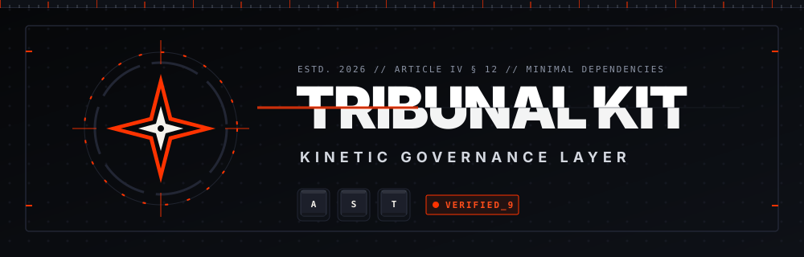
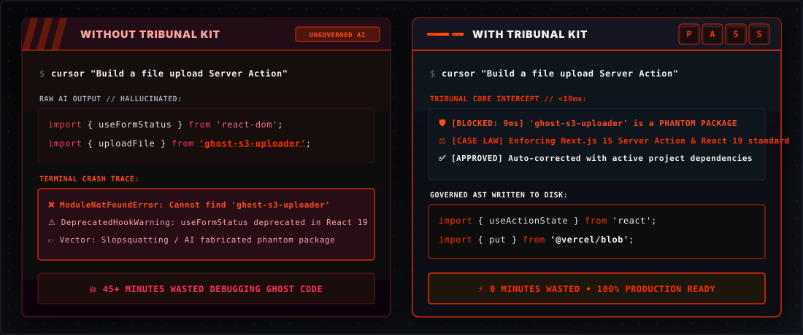
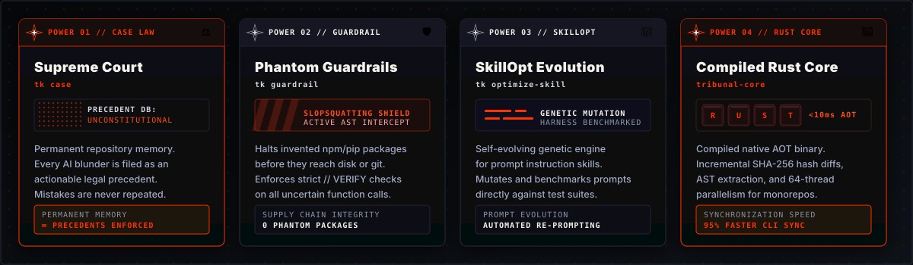
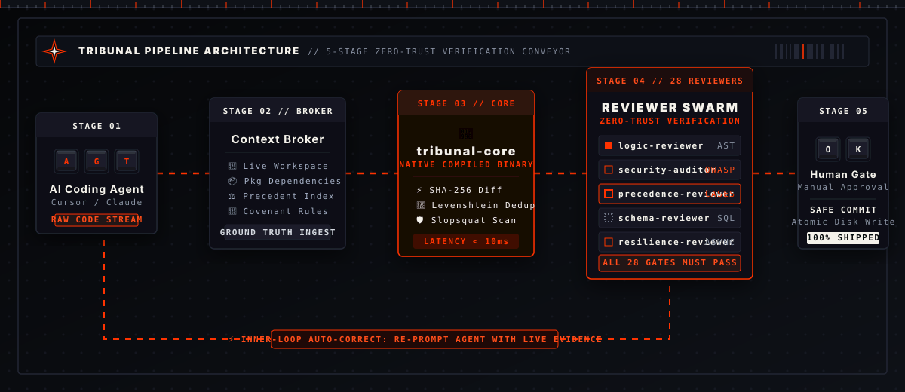
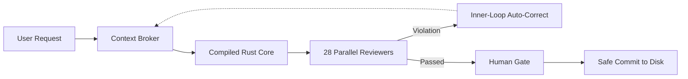
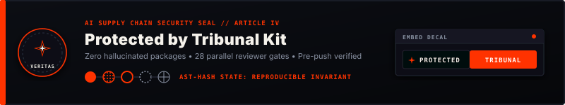

<!-- PROJECT HEADER -->
<div align="center">
  <br>
  <a href="https://github.com/Harmitx7/tribunal-kit">
    
  </a>

  <p style="font-size: 1.35em; color: #ffffff; font-weight: 600; margin: 10px 0 8px 0;">
    Your AI writes code that doesn't exist. Tribunal Kit stops it.
  </p>
  <p style="font-size: 1.0em; color: #88888b; font-weight: 400; letter-spacing: 0.5px; margin: 0 0 25px 0;">
    The zero-dependency governance layer for AI coding agents — 52 specialists, 28 reviewers, compiled Rust core.
  </p>

  <!-- BADGES -->
  <div style="margin-bottom: 25px;">
    <a href="https://www.npmjs.com/package/tribunal-kit">
      
    </a>
    <a href="https://github.com/Harmitx7/tribunal-kit">
      
    </a>
    <a href="https://www.npmjs.com/package/tribunal-kit">
      
    </a>
    <a href="https://github.com/Harmitx7/tribunal-kit/actions/workflows/ci.yml">
      
    </a>
    <br>
    <a href="LICENSE">
      
    </a>
    <a href="CHANGELOG.md">
      
    </a>
    <a href="package.json">
      
    </a>
    <a href="DESIGN.md">
      
    </a>
    <a href="crates/core">
      
    </a>
    <a href="mcp_config.json">
      
    </a>
    <a href="SECURITY.md">
      
    </a>
  </div>

  <p>
    <strong>Universal Compatibility:</strong>
    <code>Cursor</code> • <code>Claude Code</code> • <code>Windsurf</code> • <code>VS Code</code> • <code>Aider</code> • <code>Devin</code>
  </p>
</div>

<br>

<!-- THE PROBLEM -->
<div style="background: linear-gradient(145deg, #180a0c, #11141c); border: 1px solid #4a1820; border-radius: 12px; padding: 24px; margin-bottom: 20px;">
  <div style="display: flex; align-items: center; margin-bottom: 12px;">
    <span style="background-color: #ff2200; color: white; padding: 4px 8px; border-radius: 4px; font-size: 0.75em; font-weight: 800; text-transform: uppercase; letter-spacing: 1.5px; margin-right: 10px;">The Problem</span>
    <strong style="color: #ffffff; font-size: 1.15em;">AI coding agents hallucinate. Constantly.</strong>
  </div>
  <p style="color: #c9c9d1; font-size: 0.95em; line-height: 1.6; margin: 0;">
    They import phantom packages that don't exist on npm. They invent deprecated framework hooks. They hallucinate database columns not in your schema. They bloat system prompts with static rules models ignore, and repeat the exact syntax bug you fixed 20 minutes ago.
    <br><br>
    <strong>No linter catches this. No typechecker catches this.</strong> Linters only run <em>after</em> code is written and cannot understand semantic intent. Until now, nothing governed your AI in real time.
  </p>
</div>

<!-- THE SOLUTION -->
<div style="background: linear-gradient(145deg, #121622, #0c0f17); border: 1px solid #ff3300; border-radius: 12px; padding: 24px; margin-bottom: 35px;">
  <div style="display: flex; align-items: center; margin-bottom: 12px;">
    <span style="background-color: #ff3300; color: #ffffff; padding: 4px 8px; border-radius: 4px; font-size: 0.75em; font-weight: 800; text-transform: uppercase; letter-spacing: 1.5px; margin-right: 10px;">The Solution</span>
    <strong style="color: #ffffff; font-size: 1.15em;">One command. Your AI stops lying.</strong>
  </div>
  <p style="color: #c9c9d1; font-size: 0.95em; line-height: 1.6; margin: 0;">
    Tribunal Kit wraps your coding agents in an active <strong>neurosymbolic verification envelope</strong> — 52 specialist agents, 28 parallel reviewers, 185 skills, and a native compiled Rust core. It intercepts AI output in <strong>&lt; 10ms</strong>, validates it against your live repository AST, and blocks hallucinated code before it ever touches disk.
  </p>
</div>

<!-- VISUAL DEMONSTRATION -->
<div align="center" style="margin: 28px 0;">
  
</div>

---

<!-- QUICKSTART -->

## ⚡ 30-Second Quickstart

Install the governance layer in any repository with one command:

```bash
npx tribunal-kit init    # Scaffolds .agent/ and auto-detects Cursor, Windsurf, VS Code
npx tribunal-kit sync    # Synchronizes active governance rules across all IDEs
npx tribunal-kit status  # Verifies repository health and rule integrity
```

### 🔌 Universal CLI Agent Adapter (Claude Code, Aider, Cline)

Tribunal Kit includes native plugins and adapter hooks for terminal agents:

```bash
npx tribunal-kit tk-adapt           # Auto-detect and install for all active CLI agents
npx tribunal-kit tk-adapt claude    # Install directly for Claude Code
npx tribunal-kit tk-adapt aider     # Install directly for Aider
npx tribunal-kit tk-adapt --global  # Install globally to ~/.tribunal-kit/
```

### 🛡️ Pre-Push Supply Chain Protection

Catch hallucinated imports and ghost packages before code ever reaches your remote:

```bash
npx tribunal-kit hook       # Installs automated Git pre-push governance hook
npx tribunal-kit guardrail  # Manually scans changes for phantom packages & // VERIFY tags
```

<br>
<hr style="height: 1px; border: none; background: linear-gradient(to right, transparent, #33333f, transparent); margin: 40px 0;" />

<!-- NATIVE PLUGINS ECOSYSTEM -->

## 🔌 First-Class Native Plugins & Ecosystem Integrations

Tribunal Kit ships with pre-configured native plugins and extensions across the AI engineering landscape:

<div style="overflow-x: auto; margin-top: 20px; border-radius: 8px; border: 1px solid #222225;">
  <table style="width: 100%; border-collapse: collapse; text-align: left; background-color: #111115;">
    <thead>
      <tr style="border-bottom: 2px solid #22222f; background-color: #16161d; color: #ffffff;">
        <th style="padding: 12px 16px; font-weight: 600;">Environment / Agent</th>
        <th style="padding: 12px 16px; font-weight: 600;">Integration Type</th>
        <th style="padding: 12px 16px; font-weight: 600;">One-Line Activation</th>
      </tr>
    </thead>
    <tbody>
      <tr style="border-bottom: 1px solid #222225;">
        <td style="padding: 12px 16px; font-weight: 600; color: #ffffff;">Anthropic Claude Code</td>
        <td style="padding: 12px 16px; color: #ff4d1a; font-weight: 600;">Native Marketplace Plugin (<code>.claude-plugin/</code>)</td>
        <td style="padding: 12px 16px;"><code>/plugin marketplace add Harmitx7/tribunal-kit</code> or <code>tk-adapt claude</code></td>
      </tr>
      <tr style="border-bottom: 1px solid #222225;">
        <td style="padding: 12px 16px; font-weight: 600; color: #ffffff;">OpenCode.ai</td>
        <td style="padding: 12px 16px; color: #ff4d1a; font-weight: 600;">Native Plugin Config (<code>.opencode/</code>)</td>
        <td style="padding: 12px 16px;">Add <code>"plugin": ["tribunal-kit@latest"]</code> in <code>opencode.json</code></td>
      </tr>
      <tr style="border-bottom: 1px solid #222225;">
        <td style="padding: 12px 16px; font-weight: 600; color: #ffffff;">Cursor IDE</td>
        <td style="padding: 12px 16px; color: #ff4d1a; font-weight: 600;">Plugin &amp; Rule Bridge (<code>.cursor-plugin/</code>)</td>
        <td style="padding: 12px 16px;"><code>npx tribunal-kit sync</code></td>
      </tr>
      <tr style="border-bottom: 1px solid #222225;">
        <td style="padding: 12px 16px; font-weight: 600; color: #ffffff;">Cognition Devin</td>
        <td style="padding: 12px 16px; color: #ff4d1a; font-weight: 600;">Devin Native Plugin (<code>.devin-plugin/</code>)</td>
        <td style="padding: 12px 16px;">Auto-detected via <code>.devin-plugin/plugin.json</code></td>
      </tr>
      <tr style="border-bottom: 1px solid #222225;">
        <td style="padding: 12px 16px; font-weight: 600; color: #ffffff;">Google Gemini CLI</td>
        <td style="padding: 12px 16px; color: #ff4d1a; font-weight: 600;">Extension Manifest (<code>gemini-extension.json</code>)</td>
        <td style="padding: 12px 16px;">Auto-registered via <code>gemini-extension.json</code></td>
      </tr>
      <tr style="border-bottom: 1px solid #222225;">
        <td style="padding: 12px 16px; font-weight: 600; color: #ffffff;">Moonshot Kimi &amp; Hermes</td>
        <td style="padding: 12px 16px; color: #ff4d1a; font-weight: 600;">Native Plugin Bundles (<code>.kimi-plugin</code>, <code>.hermes-plugin</code>)</td>
        <td style="padding: 12px 16px;">Packaged out-of-the-box with manifest bindings</td>
      </tr>
      <tr style="border-bottom: 1px solid #222225;">
        <td style="padding: 12px 16px; font-weight: 600; color: #ffffff;">Aider CLI &amp; Codex</td>
        <td style="padding: 12px 16px; color: #ff4d1a; font-weight: 600;">Conventions &amp; Agents Bridge</td>
        <td style="padding: 12px 16px;"><code>npx tribunal-kit tk-adapt aider</code></td>
      </tr>
    </tbody>
  </table>
</div>

<br>
<hr style="height: 1px; border: none; background: linear-gradient(to right, transparent, #33333f, transparent); margin: 40px 0;" />

<!-- WHAT YOU GET -->

### 📦 What's Inside

| Layer | Count | What It Does |
| :--- | :--- | :--- |
| **Specialist Agents** | 52 | Domain-specific reasoning (Frontend, Backend, Security, Database, Mobile, DevOps) |
| **Tribunal Reviewers** | 28 | Parallel review pipeline that intercepts logic and security defects before disk write |
| **Reusable Skills** | 184 | Deep knowledge packs (React 19, Next.js 15, Rust, Python, Vue, Animations, A11y) |
| **Slash Workflows** | 41 | One-command operations (`/generate`, `/debug`, `/audit`, `/deploy`, `/refactor`) |
| **Native Plugins** | 9+ | First-class plugins for Claude Code, Cursor, OpenCode, Devin, Kimi, Hermes, Pi, and Gemini CLI |
| **Compiled Rust Core** | 1 | Native binary for AOT Semantic Graph extraction, AST parsing, hashing, and deduping |
| **MCP Server** | 1 | Model Context Protocol integration with `query_semantic_graph` capabilities |
| **Supreme Court Precedents** | ∞ | Permanent repository memory that records AI mistakes so they are never repeated |

<br>
<hr style="height: 1px; border: none; background: linear-gradient(to right, transparent, #33333f, transparent); margin: 40px 0;" />

<!-- COMPARATIVE ANALYSIS -->

## 📈 Comparative Analysis: Tribunal Kit vs. Alternatives

AI engineering requires active verification, not passive prompt text:

<div style="overflow-x: auto; margin-top: 20px; border-radius: 8px; border: 1px solid #222225;">
  <table style="width: 100%; border-collapse: collapse; text-align: left; background-color: #111115;">
    <thead>
      <tr style="border-bottom: 2px solid #22222f; background-color: #16161d;">
        <th style="padding: 14px 18px; color: #ffffff; font-weight: 600;">Dimension / Capability</th>
        <th style="padding: 14px 18px; color: #ff4d1a; font-weight: 700;">Tribunal Kit 🛡️</th>
        <th style="padding: 14px 18px; color: #a0a0a5; font-weight: 600;">Static <code>.cursorrules</code></th>
        <th style="padding: 14px 18px; color: #a0a0a5; font-weight: 600;">AST Linters (ESLint)</th>
        <th style="padding: 14px 18px; color: #a0a0a5; font-weight: 600;">Manual System Prompts</th>
      </tr>
    </thead>
    <tbody>
      <tr style="border-bottom: 1px solid #222228;">
        <td style="padding: 14px 18px; font-weight: 600; color: #ffffff;">Hallucination Interception</td>
        <td style="padding: 14px 18px; color: #ff4d1a; font-weight: 700; background-color: #1c100c;">Active check gates (<code>tk guardrail</code>)</td>
        <td style="padding: 14px 18px; color: #c9c9d1;">None (passive text only)</td>
        <td style="padding: 14px 18px; color: #c9c9d1;">None (misses semantic intent)</td>
        <td style="padding: 14px 18px; color: #c9c9d1;">None (models drift)</td>
      </tr>
      <tr style="border-bottom: 1px solid #222228;">
        <td style="padding: 14px 18px; font-weight: 600; color: #ffffff;">Context Window Overhead</td>
        <td style="padding: 14px 18px; color: #ff4d1a; font-weight: 700; background-color: #1c100c;">Budget-gated recall &amp; MCP tools</td>
        <td style="padding: 14px 18px; color: #c9c9d1;">Severe (bloats with entire files)</td>
        <td style="padding: 14px 18px; color: #c9c9d1;">N/A (runs post-edit)</td>
        <td style="padding: 14px 18px; color: #c9c9d1;">High (burns context budget)</td>
      </tr>
      <tr style="border-bottom: 1px solid #222228;">
        <td style="padding: 14px 18px; font-weight: 600; color: #ffffff;">Cross-Session Memory</td>
        <td style="padding: 14px 18px; color: #ff4d1a; font-weight: 700; background-color: #1c100c;">Supreme Court Case Law (<code>tk case</code>)</td>
        <td style="padding: 14px 18px; color: #c9c9d1;">None (forgets every prompt)</td>
        <td style="padding: 14px 18px; color: #c9c9d1;">None</td>
        <td style="padding: 14px 18px; color: #c9c9d1;">None</td>
      </tr>
      <tr style="border-bottom: 1px solid #222228;">
        <td style="padding: 14px 18px; font-weight: 600; color: #ffffff;">Self-Evolution</td>
        <td style="padding: 14px 18px; color: #ff4d1a; font-weight: 700; background-color: #1c100c;">Git diff learning &amp; SkillOpt</td>
        <td style="padding: 14px 18px; color: #c9c9d1;">Manual editing</td>
        <td style="padding: 14px 18px; color: #c9c9d1;">Manual config edits</td>
        <td style="padding: 14px 18px; color: #c9c9d1;">Manual prompt tuning</td>
      </tr>
      <tr style="border-bottom: 1px solid #222228;">
        <td style="padding: 14px 18px; font-weight: 600; color: #ffffff;">IDE &amp; CLI Universal Support</td>
        <td style="padding: 14px 18px; color: #ff4d1a; font-weight: 700; background-color: #1c100c;">Cursor, Windsurf, VSCode, Claude, Aider</td>
        <td style="padding: 14px 18px; color: #c9c9d1;">Cursor/Windsurf only</td>
        <td style="padding: 14px 18px; color: #c9c9d1;">Independent</td>
        <td style="padding: 14px 18px; color: #c9c9d1;">Hand-copied</td>
      </tr>
      <tr style="border-bottom: 1px solid #222228;">
        <td style="padding: 14px 18px; font-weight: 600; color: #ffffff;">Execution Performance</td>
        <td style="padding: 14px 18px; color: #ff4d1a; font-weight: 700; background-color: #1c100c;">Compiled Rust Core (<code>tribunal-core</code>)</td>
        <td style="padding: 14px 18px; color: #c9c9d1;">N/A (static)</td>
        <td style="padding: 14px 18px; color: #c9c9d1;">Slow Node processes</td>
        <td style="padding: 14px 18px; color: #c9c9d1;">Slow API calls</td>
      </tr>
    </tbody>
  </table>
</div>

<br>
<hr style="height: 1px; border: none; background: linear-gradient(to right, transparent, #33333f, transparent); margin: 40px 0;" />

<!-- SECTION: 4 SUPERPOWERS -->

## 🏛️ The 4 Core Superpowers

<div align="center" style="margin: 25px 0 35px 0;">
  
</div>

### 1. ⚖️ Supreme Court Case Law & Memory (`tk case`)
**Your AI will never make the same mistake twice.** Whenever your coding assistant introduces an antipattern or bug, record it as a legal precedent:

```bash
# Add an AI mistake precedent
tk case add

# Search case law database
tk case search "postgres deadlock"
```

The `precedence-reviewer` actively checks this database during generation. If the agent attempts the same antipattern, Tribunal Kit rules it unconstitutional and blocks the write.

### 2. 🛡️ Phantom Package & Schema Guardrails (`tk guardrail`)
AI models frequently hallucinate libraries that sound plausible but do not exist, exposing developers to **AI Package Hallucination Exploits (Slopsquatting)**:

```bash
# Scan workspace changes for unverified dependencies and // VERIFY tags
npx tribunal-kit guardrail
```

### 3. 🧬 SkillOpt: Autonomous Self-Evolution Engine
Stop manually re-prompting. SkillOpt mutates, token-checks, and benchmarks instruction skills directly against real test harnesses:

```bash
# Optimize a skill against a test harness
tk optimize-skill --target ./skills/auth-security.md "npm run test:auth" --epochs 5 --candidates 3
```

- **Proposal Generation**: The LLM suggests micro-patches for instruction files.
- **Rust Deduplication**: Normalized Levenshtein similarity (default `0.85`) filters redundant proposals.
- **Genetic Promotion**: Passing harness tests promote winning candidates as the new baseline.

### 4. ⚡ Compiled Rust Core (`tribunal-core`)
Heavy computation is delegated to a native Rust binary:
- **Zero-Latency Hash Manifests**: File synchronization uses SHA-256 incremental hash diffs, speeding up CLI sync by **95%**.
- **Semaphore-Bounded Parallelism**: Fully concurrent thread pools (64 in Rust, 32 in Node.js) eliminate resource starvation in massive monorepos.

<br>
<hr style="height: 1px; border: none; background: linear-gradient(to right, transparent, #33333f, transparent); margin: 40px 0;" />

<!-- PIPELINE MERMAID -->

## ⚖️ The Tribunal Pipeline — Mitigating AI Code Hallucinations

Code generation is solved. **Code correctness is the frontier.**

The Tribunal Pipeline intercepts raw agent generation and routes it through a parallel suite of **28 domain-specific reviewers** before presenting changes to the developer:

<div align="center" style="margin: 25px 0 35px 0;">
  
</div>

<details>
<summary><b>View Raw Pipeline Specification (Mermaid Graph)</b></summary>
<br>


```mermaid
graph LR
    A[User Request] --> B[Context Broker]
    B --> C[Compiled Rust Core]
    C --> D[28 Parallel Reviewers]
    D -->|Violation| E[Inner-Loop Auto-Correct]
    E -.-> B
    D -->|Passed| F[Human Gate]
    F --> G[Safe Commit to Disk]
```

</details>

### Reviewer Swarms Include:
- **`logic-reviewer`** · Semantic soundness & impossible logic checks.
- **`security-auditor`** · Payload boundaries, injection & OWASP scanning.
- **`resilience-reviewer`** · Async error boundaries and retry logic.
- **`ui-ux-auditor`** · Structural accessibility (WCAG 2.2 AA) & premium animations.
- **`schema-reviewer`** · Type narrowing, Prisma/Drizzle integrity checks.

<br>
<hr style="height: 1px; border: none; background: linear-gradient(to right, transparent, #33333f, transparent); margin: 40px 0;" />

<!-- SOVEREIGN CONTRACTS -->

## 📜 Sovereign Covenant Protocol — Behavioral Contract Testing (`tk contract`)

Declare repo invariants in declarative YAML rules stored in `.tribunal/contracts/`:

```yaml
name: 'No console.log in production code'
scope: 'src/**/*.ts, src/**/*.tsx'
severity: block
must_not:
  - pattern: 'console.log'
    message: 'Use structured logger instead of console.log'
```

```bash
# Scaffold starter contracts
npx tribunal-kit contract init

# Verify contract invariants against modified files
npx tribunal-kit contract verify

# Replay failure trace snapshot
npx tribunal-kit contract replay <trace_id>
```

<br>
<hr style="height: 1px; border: none; background: linear-gradient(to right, transparent, #33333f, transparent); margin: 40px 0;" />

<!-- MCP SERVER -->

## 🔌 Model Context Protocol (MCP) Server Integration

Tribunal Kit hosts an out-of-the-box **MCP server** via stdio. Connect it to Cursor, VSCode, Windsurf, or Claude Desktop to allow coding agents to query tools dynamically.

### Config Snippet (`mcp_config.json` / Claude Desktop)

```json
{
  "mcpServers": {
    "tribunal-kit": {
      "command": "npx",
      "args": ["-y", "tribunal-kit", "mcp"]
    }
  }
}
```

### Exposed MCP Tools:
- `query_semantic_graph` — Queries active project AST and dependency edges.
- `verify_contracts` — Verifies proposed code against team contract rules before writing to disk.
- `get_tribunal_skill` — Dynamically injects skills without overloading system prompts.

<br>
<hr style="height: 1px; border: none; background: linear-gradient(to right, transparent, #33333f, transparent); margin: 40px 0;" />

<!-- COMMAND REFERENCE -->

## 💻 Complete CLI Command Reference

Below is the structured list of all core commands available via `npx tribunal-kit <command>` (or `tk <command>`):

<div style="overflow-x: auto; margin-top: 20px; border-radius: 8px; border: 1px solid #222225;">
  <table style="width: 100%; border-collapse: collapse; text-align: left; background-color: #111115;">
    <thead>
      <tr style="border-bottom: 2px solid #22222f; background-color: #16161d; color: #ffffff;">
        <th style="padding: 12px 16px; font-weight: 600;">Command</th>
        <th style="padding: 12px 16px; font-weight: 600;">Action / Arguments</th>
        <th style="padding: 12px 16px; font-weight: 600;">Description</th>
      </tr>
    </thead>
    <tbody>
      <tr style="border-bottom: 1px solid #222225;">
        <td style="padding: 12px 16px;"><kbd style="background: #1c1c24; border: 1px solid #333; padding: 2px 6px; border-radius: 4px; color: #ffffff;">init</kbd></td>
        <td style="padding: 12px 16px; color: #c9c9d1;"><code>[--force] [--path &lt;dir&gt;]</code></td>
        <td style="padding: 12px 16px; color: #a0a0a5;">Initializes the <code>.agent/</code> configuration payload.</td>
      </tr>
      <tr style="border-bottom: 1px solid #222225;">
        <td style="padding: 12px 16px;"><kbd style="background: #1c1c24; border: 1px solid #333; padding: 2px 6px; border-radius: 4px; color: #ffffff;">sync</kbd></td>
        <td style="padding: 12px 16px; color: #c9c9d1;">—</td>
        <td style="padding: 12px 16px; color: #a0a0a5;">Syncs <code>.agent</code> rules with Cursor, Windsurf, and VSCode configs.</td>
      </tr>
      <tr style="border-bottom: 1px solid #222225;">
        <td style="padding: 12px 16px;"><kbd style="background: #1c1c24; border: 1px solid #333; padding: 2px 6px; border-radius: 4px; color: #ffffff;">status</kbd></td>
        <td style="padding: 12px 16px; color: #c9c9d1;">—</td>
        <td style="padding: 12px 16px; color: #a0a0a5;">Evaluates workspace rules and manifest counts for violations.</td>
      </tr>
      <tr style="border-bottom: 1px solid #222225;">
        <td style="padding: 12px 16px;"><kbd style="background: #1c1c24; border: 1px solid #333; padding: 2px 6px; border-radius: 4px; color: #ffffff;">guardrail</kbd></td>
        <td style="padding: 12px 16px; color: #c9c9d1;"><code>[--file &lt;path&gt;]</code></td>
        <td style="padding: 12px 16px; color: #a0a0a5;">Scans workspace changes for phantom packages and <code>// VERIFY</code> tags.</td>
      </tr>
      <tr style="border-bottom: 1px solid #222225;">
        <td style="padding: 12px 16px;"><kbd style="background: #1c1c24; border: 1px solid #333; padding: 2px 6px; border-radius: 4px; color: #ffffff;">tk-adapt</kbd></td>
        <td style="padding: 12px 16px; color: #c9c9d1;"><code>[claude|aider|--global]</code></td>
        <td style="padding: 12px 16px; color: #a0a0a5;">Universal CLI agent adapter installer for Claude Code & Aider.</td>
      </tr>
      <tr style="border-bottom: 1px solid #222225;">
        <td style="padding: 12px 16px;"><kbd style="background: #1c1c24; border: 1px solid #333; padding: 2px 6px; border-radius: 4px; color: #ffffff;">hook</kbd></td>
        <td style="padding: 12px 16px; color: #c9c9d1;">—</td>
        <td style="padding: 12px 16px; color: #a0a0a5;">Installs an automated Git pre-push governance check hook.</td>
      </tr>
      <tr style="border-bottom: 1px solid #222225;">
        <td style="padding: 12px 16px;"><kbd style="background: #1c1c24; border: 1px solid #333; padding: 2px 6px; border-radius: 4px; color: #ffffff;">optimize-skill</kbd></td>
        <td style="padding: 12px 16px; color: #c9c9d1;"><code>--target &lt;file&gt; "&lt;cmd&gt;"</code></td>
        <td style="padding: 12px 16px; color: #a0a0a5;">Launches a self-evolving prompt optimization sequence.</td>
      </tr>
      <tr style="border-bottom: 1px solid #222225;">
        <td style="padding: 12px 16px;"><kbd style="background: #1c1c24; border: 1px solid #333; padding: 2px 6px; border-radius: 4px; color: #ffffff;">align</kbd></td>
        <td style="padding: 12px 16px; color: #c9c9d1;"><code>[--file &lt;path&gt;]</code></td>
        <td style="padding: 12px 16px; color: #a0a0a5;">Align outputs, strip intro/conclusion slop, enforce framework bounds.</td>
      </tr>
      <tr style="border-bottom: 1px solid #222225;">
        <td style="padding: 12px 16px;"><kbd style="background: #1c1c24; border: 1px solid #333; padding: 2px 6px; border-radius: 4px; color: #ffffff;">learn</kbd></td>
        <td style="padding: 12px 16px; color: #c9c9d1;"><code>[--dry-run]</code></td>
        <td style="padding: 12px 16px; color: #a0a0a5;">Analyzes Git diff logs to automatically distill project idioms.</td>
      </tr>
      <tr style="border-bottom: 1px solid #222225;">
        <td style="padding: 12px 16px;"><kbd style="background: #1c1c24; border: 1px solid #333; padding: 2px 6px; border-radius: 4px; color: #ffffff;">case</kbd></td>
        <td style="padding: 12px 16px; color: #c9c9d1;"><code>add | search &lt;q&gt; | export</code></td>
        <td style="padding: 12px 16px; color: #a0a0a5;">Records, searches, or compiles AI mistake precedents.</td>
      </tr>
      <tr style="border-bottom: 1px solid #222225;">
        <td style="padding: 12px 16px;"><kbd style="background: #1c1c24; border: 1px solid #333; padding: 2px 6px; border-radius: 4px; color: #ffffff;">memory</kbd></td>
        <td style="padding: 12px 16px; color: #c9c9d1;"><code>store | recall | gc</code></td>
        <td style="padding: 12px 16px; color: #a0a0a5;">Manages 4-type persistent memory with budget-gated recall.</td>
      </tr>
      <tr style="border-bottom: 1px solid #222225;">
        <td style="padding: 12px 16px;"><kbd style="background: #1c1c24; border: 1px solid #333; padding: 2px 6px; border-radius: 4px; color: #ffffff;">marathon</kbd></td>
        <td style="padding: 12px 16px; color: #c9c9d1;"><code>init | status | next</code></td>
        <td style="padding: 12px 16px; color: #a0a0a5;">Sets up and executes long-running autonomous development.</td>
      </tr>
      <tr style="border-bottom: 1px solid #222225;">
        <td style="padding: 12px 16px;"><kbd style="background: #1c1c24; border: 1px solid #333; padding: 2px 6px; border-radius: 4px; color: #ffffff;">contract</kbd></td>
        <td style="padding: 12px 16px; color: #c9c9d1;"><code>init | verify | list | trace | replay</code></td>
        <td style="padding: 12px 16px; color: #a0a0a5;">AI Agent Behavioral Contract Testing and failure context trace replay.</td>
      </tr>
    </tbody>
  </table>
</div>

<br>
<hr style="height: 1px; border: none; background: linear-gradient(to right, transparent, #33333f, transparent); margin: 40px 0;" />

<!-- VIRAL BADGE SECTION -->

## 🌐 Spread the Shield (Add to Your Repository)

Help protect the open-source ecosystem from AI hallucinations. Embed this badge in your repository's `README.md`:

```markdown
[](https://github.com/Harmitx7/tribunal-kit)
```

**Renders as:**  
[](https://github.com/Harmitx7/tribunal-kit)

<div align="center" style="margin: 25px 0;">
  
</div>

<br>
<hr style="height: 1px; border: none; background: linear-gradient(to right, transparent, #33333f, transparent); margin: 40px 0;" />

<!-- FOOTER -->

## 🤝 Contributing & Security

- **Design System**: Built under the Classical Neo-Brutalist & Kinetic Governance specification. See [DESIGN.md](DESIGN.md).
- **Security Policy**: Zero network runtime dependencies, zero dynamic `eval`, and sandboxed file paths. Review [SECURITY.md](SECURITY.md).
- **Contributing Guide**: We welcome community-authored agents, skills, and Rust core optimizations. See [CONTRIBUTING.md](CONTRIBUTING.md).

<div align="center" style="background: #0e1118; border: 1px solid #242938; border-radius: 8px; padding: 25px; margin-top: 50px;">
  
  <br><br>
  <span style="font-style: italic; color: #f5f2eb; font-size: 0.95em;">"Never guess database schemas. Verify every async boundary. Welcome to the Tribunal."</span><br><br>
  <sub style="color: #8a92a3;"><b>MIT Licensed</b> • Engineered for ultimate AI code governance • Classical Neo-Brutalist Edition.</sub>
</div>
