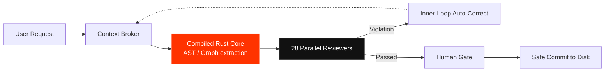

<!-- PROJECT HEADER -->
<div align="center">
  <br>
  <a href="https://github.com/Harmitx7/tribunal-kit">
    
  </a>

  <h1 style="font-size: 1.35em; color: #ffffff; font-weight: 600; margin: 10px 0 8px 0;">
    Tribunal Kit
  </h1>
  <p style="font-size: 1.0em; color: #88888b; font-weight: 400; letter-spacing: 0.5px; margin: 0 0 25px 0;">
    The minimal-dependency governance layer for AI coding agents. Real-time hallucination prevention, parallel AST review, and cross-session memory via a compiled Rust core.
  </p>

  <!-- BADGES -->
  <div style="margin-bottom: 25px;">
    <a href="https://www.npmjs.com/package/tribunal-kit">
      
    </a>
    <a href="https://github.com/Harmitx7/tribunal-kit/actions/workflows/ci.yml">
      
    </a>
    <a href="LICENSE">
      
    </a>
    <a href="package.json">
      
    </a>
    <a href="crates/core">
      
    </a>
    <a href="mcp_config.json">
      
    </a>
  </div>

  <p>
    <strong>Universal Compatibility:</strong>
    <code>Cursor</code> • <code>Claude Code</code> • <code>Windsurf</code> • <code>VS Code</code> • <code>Aider</code> • <code>Devin</code>
  </p>
</div>

<br>

## 🛡️ Value Proposition

AI coding assistants frequently hallucinate dependencies, deprecated framework hooks, and incorrect database columns. Linters and typecheckers catch these errors only *after* the code is written, failing to understand semantic intent during generation.

Tribunal Kit acts as a **neurosymbolic verification envelope**. It intercepts AI output locally in **&lt; 10ms**, validates it against your live repository AST, and prevents hallucinated code and phantom packages from ever touching your disk. 

---

## ⚡ Core Capabilities

- **Parallel Review Pipeline:** 28 domain-specific reviewers analyze generated code simultaneously before the write operation.
- **Compiled Rust Core:** Sub-10ms AST parsing, semantic graph extraction, and file synchronization using SHA-256 diffs.
- **Phantom Package Guardrails:** Blocks "slopsquatting" and non-existent npm package imports during generation.
- **Cross-Session Memory:** "Supreme Court Case Law" (`tk case`) records past AI mistakes so they are never repeated across sessions.
- **Subagent-Driven Development (SDD):** Orchestrates multi-agent fan-out and synthesis, strictly isolating context windows to prevent token bloat.
- **Minimal Dependencies:** The Node.js CLI runtime requires almost zero production dependencies, protecting your supply chain.
- **Native MCP Server:** Exposes real-time repository AST and team contract rules to Model Context Protocol compatible clients.

---

## 🏗️ Architecture Overview

Tribunal Kit operates as a fast, intercepting middleware layer between the AI generation event and the local filesystem.


```mermaid
graph LR
    A[User Request] --> B[Context Broker]
    B --> C[Compiled Rust Core<br/>AST / Graph extraction]
    C --> D[28 Parallel Reviewers]
    D -->|Violation| E[Inner-Loop Auto-Correct]
    E -.-> B
    D -->|Passed| F[Human Gate]
    F --> G[Safe Commit to Disk]

    style C fill:#ff3300,stroke:#fff,stroke-width:1px,color:#fff
    style D fill:#111,stroke:#444,stroke-width:1px,color:#fff
```

### Data Flow

1. **Input:** An LLM agent generates a code change proposal (or triggers a workflow like `/generate`).
2. **Processing:** The Rust Core extracts the current AST and validates the semantic bounds. The proposal is dispatched to parallel Reviewers (e.g., `logic-reviewer`, `security-auditor`).
3. **Output:** If valid, it passes to the Human Gate or writes directly to disk. If invalid, the process is halted, and feedback is fed back into the agent's context loop.

---

## 🚀 Installation & Quick Start

Install Tribunal Kit in your project directory. Node.js >= 18.0.0 is required.

```bash
# 1. Initialize Tribunal Kit in your repository
npx tribunal-kit init

# 2. Sync rules with your local IDE (Cursor, Windsurf, VS Code)
npx tribunal-kit sync

# 3. Verify repository health and active rules
npx tribunal-kit status
```

**Using a CLI Agent?**
Install the native adapter for Claude Code or Aider:
```bash
npx tribunal-kit tk-adapt claude
# or
npx tribunal-kit tk-adapt aider
```

---

## 💻 Usage Guide & CLI Reference

Tribunal Kit CLI operations are routed through the compiled Rust binary when supported, falling back to the JavaScript engine gracefully.

| Command | Arguments | Description |
| :--- | :--- | :--- |
| `init` | `[--force]` | Initializes the `.agent/` configuration payload. |
| `sync` | — | Syncs rules with IDEs (.cursorrules, .windsurfrules). |
| `status` | — | Evaluates workspace rules and checks for violations. |
| `guardrail` | `[--file <path>]` | Scans changes for phantom packages and `// VERIFY` tags. |
| `tk-adapt` | `[claude\|aider\|--global]` | Installs universal CLI agent adapters. |
| `hook` | — | Installs the automated Git pre-push governance hook. |
| `memory` | `store \| recall \| gc` | Manages persistent cross-session AI memory. |
| `case` | `add \| search <q>` | Records or searches for AI mistake precedents. |

*(For workflow execution, Tribunal Kit monitors for slash commands like `/orchestrate`, `/audit`, or `/deploy` inside your AI context).*

---

## ⚙️ Configuration Reference

Tribunal Kit is largely zero-config, driven by the `.agent/` directory, but exposes settings via `mcp_config.json` and `package.json`.

**Example MCP Configuration (`mcp_config.json`)**
```json
{
  "mcpServers": {
    "tribunal-kit": {
      "command": "node",
      "args": [".agent/scripts/mcp_server.js"],
      "env": { "NODE_ENV": "production" }
    }
  }
}
```

---

## 📂 Project Structure

```text
tribunal-kit/
├── .agent/              # Active AI governance rules and workflows
│   ├── agents/          # Specialist agent definitions
│   ├── scripts/         # Verification and build scripts
│   ├── skills/          # Reusable AI knowledge packs
│   └── workflows/       # Slash command executions (e.g., /orchestrate)
├── bin/                 # CLI entry points (wrapper.js)
├── crates/core/         # Compiled Rust semantic engine
├── dist/                # JS Fallback CLI runtime
├── docs/                # Project documentation and assets
└── AGENTS.md            # Master Fabel protocol and rule registry
```

---

## 🔗 Integrations

| Environment / Tool | Integration Type | Status |
| :--- | :--- | :--- |
| **Cursor IDE** | Plugin & `.cursorrules` bridge | Supported |
| **Anthropic Claude Code** | Native Marketplace Plugin (`.claude-plugin/`) | Supported |
| **Windsurf** | Native `.windsurfrules` sync | Supported |
| **Cognition Devin** | Native Plugin (`.devin-plugin/`) | Supported |
| **Aider CLI** | Conventions Bridge (`tk-adapt`) | Supported |
| **Google Gemini CLI** | Extension Manifest (`gemini-extension.json`) | Supported |

---

## 🔒 Security and Reliability

- **Strict Sandboxing:** Tribunal Kit executes entirely locally. It does not phone home, exfiltrate data, or execute arbitrary remote binaries.
- **Zero Dependencies:** The production NPM distribution is meticulously engineered to have zero external dependencies, entirely neutralizing downstream supply-chain attacks.
- **Memory Boundaries:** Context provided to agents is strictly bounded by the `context_broker`, preventing context overflow and reducing token hallucination vectors.

---

## 🧪 Testing and Quality

Tribunal Kit employs rigorous continuous integration.

```bash
# Run payload validation and the Jest test suite
npm run test:all

# Run the Rust core test suite
npm run test:rust
```

The validation pipeline enforces `validate-payload.js` checks to ensure every specialist agent, workflow, and skill definition conforms to the strict schema before compilation.

---

## ⚡ Performance

By offloading AST evaluation and file hashing to the `tribunal-core` Rust binary, Tribunal Kit achieves:
- **Sub-10ms** execution overhead for the `guardrail` and `sync` commands.
- Up to **95% faster** context validation compared to standard Node.js implementations traversing large monorepos.

*(Benchmarks available via `npm run benchmark:rust` locally)*.

---

## 🤝 Contributing

We welcome community-authored agents, skills, and Rust core optimizations.

1. Ensure Node.js 18+ and Rust/Cargo are installed.
2. Build the Rust core: `npm run build:rust`
3. Run tests: `npm run test:all`
4. Review [CONTRIBUTING.md](CONTRIBUTING.md) and [DESIGN.md](DESIGN.md) before submitting pull requests.

---

## 📄 License

This project is open-source and licensed under the **MIT License**. See the [LICENSE](LICENSE) file for details.

<br>
<div align="center">
  
  <br><br>
  <span style="font-style: italic; color: #8a92a3; font-size: 0.95em;">Engineered for ultimate AI code governance.</span>
</div>
