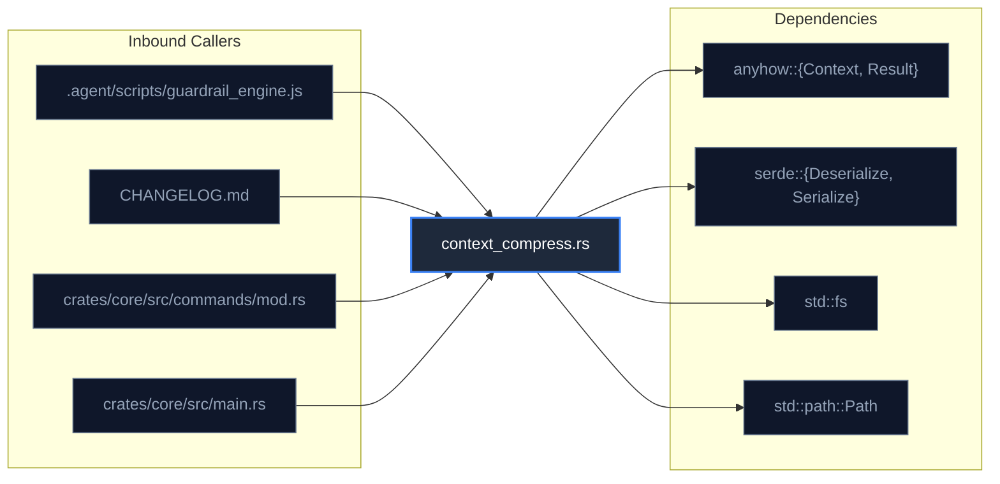

<!-- AI_QUICK_INJECT_START -->
> [!TIP]
> **AI Prompt Injection Card (Copy into future prompts touching this file):**
> ```yaml
> Target: crates/core/src/commands/context_compress.rs (Command / Dispatch Layer)
> Role: Core logic for context_compress.rs.
> Exports: [compress_context]
> Inbound Callers: 12 active consumer sites.
> Invariant Check: Verify test passing before merge: npm test
> ```
<!-- AI_QUICK_INJECT_END -->

# 🧭 FILE DOSSIER: `context_compress.rs`
`crates/core/src/commands/context_compress.rs` • **Command / Dispatch Layer** • **Hash:** `8f71783b939cf30b`

| Freshness | Blast Radius | Exports Count | Test Coverage | Primary Callers |
| :--- | :--- | :--- | :--- | :--- |
| 🟢 **Fresh** (`8f71783b939cf30b`) | **12 Callers** | **1 Symbols** | ⚠️ Unlinked | `.agent/scripts/guardrail_engine.js` |

---

## ⚡ 30-Second Mental Model
> **Mission:** Implements command / dispatch layer responsibilities for `crates/core/src/commands/context_compress.rs`, exposing verified interfaces to callers while adhering to Tribunal safety standards.

---

## 📋 Public API & Type Contract Matrix

| Symbol | Kind | Signature | Location |
| :--- | :--- | :--- | :--- |
| `compress_context` | `function` | `pub fn compress_context(file_path: &str, max_lines: Option<usize>) -> Result<String>` | Line 16 |
| `CompressResult` | `struct` | `pub struct CompressResult` | Line 7 |

---

## 🔗 Blast Radius & Call Topology



### Inbound Consumer Sites
| Caller File | Line Snippet | Vector |
| :--- | :--- | :--- |
| `.agent/scripts/guardrail_engine.js:493` | `const requiredMods = ['context_broker', 'dag_scheduler', 'context_compress'];` | Direct Import |
| `CHANGELOG.md:509` | `- **Native Context Compression Engine**: Developed `tribunal-core context-compress` (`crates/core/sr` | Symbol Reference |
| `crates/core/src/commands/mod.rs:4` | `pub mod context_compress;` | Symbol Reference |
| `crates/core/src/main.rs:599` | `Commands::ContextCompress { file, max_lines } => cmd_context_compress(&file, max_lines).await,` | Symbol Reference |
| `crates/core/src/main.rs:879` | `async fn cmd_context_compress(file: &str, max_lines: Option<usize>) -> Result<()> {` | Symbol Reference |
| `crates/core/src/main.rs:880` | `match commands::context_compress::compress_context(file, max_lines) {` | Symbol Reference |
| `test/unit/context_compiler.test.js:19` | `const targetFile = path.resolve(__dirname, '../../crates/core/src/commands/context_compress.rs');` | Symbol Reference |
| `test/unit/context_compiler.test.js:102` | `const outPath = path.resolve(workspaceRoot, 'docs/context/context_compress.context.md');` | Symbol Reference |
| `test/unit/context_compiler.test.js:118` | `const targetFile = 'crates/core/src/commands/context_compress.rs';` | Symbol Reference |
| `test/unit/context_compiler.test.js:32` | `expect(exportNames).toContain('compress_context');` | Symbol Reference |
| `test/unit/context_compiler.test.js:65` | `expect(md).toContain('compress_context');` | Symbol Reference |
| `test/unit/context_compiler.test.js:140` | `expect(res.content[0].text).toContain('compress_context');` | Symbol Reference |

---

## ⚠️ Chesterton's Fences & Non-Obvious Quirks

> [!CAUTION]
> **Line 37:** `&& trimmed.starts_with("//") && !trimmed.contains("// VERIFY") {`

> [!CAUTION]
> **Line 92:** `writeln!(file, "  // VERIFY: keep this comment").unwrap();`

---

## 🧪 Verification & Test Harness

```bash
# Run isolated tests for this module:
npm test
```
