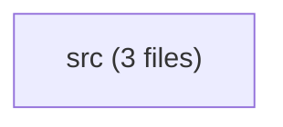

<!-- PROJECT_AI_ONBOARDING_CARD -->
Project Subsystem: tribunal-kit/crates/core
Manifests: Cargo.toml
Subsystems: src
<!-- /PROJECT_AI_ONBOARDING_CARD -->

# 🏛️ SUBSYSTEM DOSSIER: `tribunal-kit/crates/core`

## 🗺️ Subsystem Architecture Clusters

## 📂 Subsystem Breakdown
| Subsystem Folder | File Count | Samples |
| :--- | :--- | :--- |
| `src/` | 3 | `commands, main.rs, tui` |
