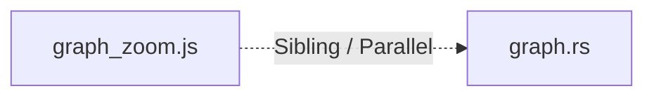

# 🌉 INTERFACE BRIDGE DOSSIER
**Module A:** `tribunal-kit/.agent/scripts/graph_zoom.js`  
**Module B:** `tribunal-kit/crates/core/src/commands/graph.rs`  
**Coupling Relationship:** `Sibling / Peer Modules`

---

## 🗺️ Cross-Boundary Topology

## 📦 Shared Types & Interfaces
- *No identical type names detected between modules.*

## 📋 Interface Alignment Summary
- **graph_zoom.js Exports:** 0 symbols.
- **graph.rs Exports:** 1 symbols.
